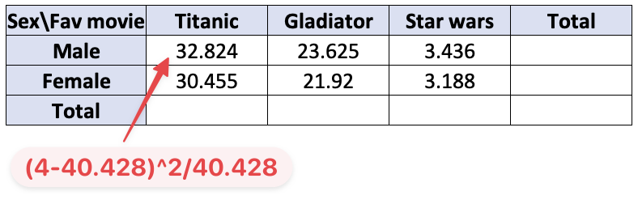
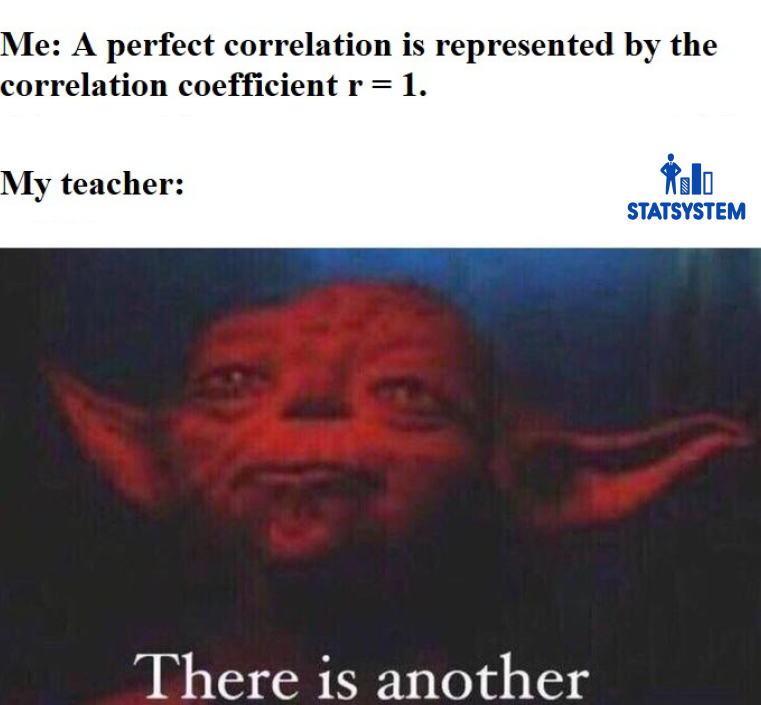

```{css, echo=FALSE}
.red { color: red; }
.blue { color: #378C95; }
strong { color: red; }
a { color: #378C95; font-weight: bold; }
.remark-inline-code { font-weight: 900; background-color: #a7d5e7; }
.caption { color: #378C95; font-style: italic; text-align: center; }

.content-box { 
box-sizing: content-box;
background-color: #378C95;
/* Total width: 160px + (2 * 20px) + (2 * 8px) = 216px
Total height: 80px + (2 * 20px) + (2 * 8px) = 136px
Content box width: 160px
Content box height: 80px */
}

.content-box-green {
background-color: #d9edc2;
}

.content-box-red {
background-color: #f9dbdb;
}

.fullprice {
text-decoration: line-through;
}
```

```{r xaringan-themer, include=FALSE, warning=FALSE}
library(xaringanthemer)
library(knitr)
library(granatlib)
library(tidyverse)
library(emo)
style_mono_accent(
  base_color = "#DC322F",               # bright red
  inverse_background_color = "#002B36", # dark dark blue
  inverse_header_color = "#378C95",     # light aqua green
  inverse_text_color = "#FFFFFF",       # white
  title_slide_background_color = "var(--base)",
  text_font_google = google_font("Kelly Slab"),
  header_font_google = google_font("Oleo Script")
)

xaringanExtra::use_panelset()
xaringanExtra::html_dependency_clipboard()
xaringanExtra::html_dependency_scribble(pen_color = "#378C95", 3, 4)
xaringanExtra::use_tile_view()
```

```{r setup, include=FALSE}
options(htmltools.dir.version = FALSE)
knitr::opts_chunk$set(echo = FALSE, fig.align = "center", error = TRUE, message = F, warning = F)
```


# Today's .blue[Agenda]

### Session 1 - Pairwise "correlation" methods

1. Contingency `r ji("bar_chart")`

2. Pearson 

3. Variance analysis

### Session 2 - Introduction to .fullprice[Multi]Tidyverse `r ji("earth")`


2. {dplyr} `r ji("tool")`

3. {tidyr} `r ji("broom")`

---

# Why do bivariate comparisons?

--

Remember:

> The entire statistical methodology runs through an **information-compressing approach**.

--

- In the case of a correlation calculation, we want to express whether, based on our knowledge of one variable, we can predict/assume st. about other variable

--

- In the case of scientific research, it is always part of the Exploratory Data Analysis (EDA)

--

- Gives good initial ideas about what you should investigate more detailed

--

- Often can be well interpreted and can be a "good story"

--

- Most of advanced methods rely on correlation or variance analysis (OLS, PCA, Clustering, ...)

---

# Contingency correlation

- This type of comparison can be applied if you have two nominal attributes [(RECALL)](https://marcellgranat.github.io/big_data2022/introduction-to-statistics.html#13)

--

- Thus this method relies on counting the equal and differing values

--

#### An illustrative example - .blue[Is there a relationship?]

```{r}
include_graphics("correlation_files/contingency_wiki.png")
```

???

source of table: https://en.wikipedia.org/wiki/Contingency_table

---

## Extreme examples

.blue[Is there a relationship?]

```{r}
include_graphics("correlation_files/contingency1.png")
```

--

.blue[Is there a relationship?]

```{r}
include_graphics("correlation_files/contingency2.png")
```

*Rule of thumb* `r ji("+1")` There is a relationship if the relative frequencies of the answers to the questions differ significantly by rows or columns.

---

### How to quantify the strength of the relationship?

--

- We will use the marginal distributions: the relative **frequency distribution** of the row column column variable in the contingency table.

The contingency table:

```{r}
include_graphics("correlation_files/contingency3.png")
```

--

.blue[Step 1.] Calculate the frequency assuming independence.

```{r}
include_graphics("correlation_files/contingency4.png")
```

---

### How to quantify the strength of the relationship?

.blue[Step 2.] Calculate $\chi^2$.

```{r}

```


$$\chi^2=32.82 +23..625 + ... + 3.188 = 115.448$$
.blue[Why squared?]

---

### How to quantify the strength of the relationship?

$$\chi^2 = 115.448$$
#### Cramér's V

$$C=\sqrt{\frac{\chi^2}{N \times \text{min}((r-1), (c-1))}},$$

where $c$ denotes the number of columns and $r$ the number of rows

C can take values between 0 (**no relationship**), 1 (**perfect relationship**)

In the current example:

$$C = .7857$$

---

class: inverse, middle, center

# Pearson correlation

---

### Types of pairwise relationship between numeric values

```{r}
cov_generate <- function(n = 10, r = 1, r2 = 0) {
  tibble(x = floor(runif(n, max = 100))) %>% 
    mutate(y = floor(runif(n, max = 10)) + r * x + r2 * x^2) %>% 
    mutate(l = NA)
}

cov_plot <- function(.data, title = "") {
  ggplot(data = .data) +
    aes(x, y, label = l) +
    geom_hline(aes(yintercept = mean(y)), lty = 2) +
    geom_vline(aes(xintercept = mean(x)), lty = 2) +
    geom_point(fill = "#378C95", shape = 21, color = "black", size = 2) +
    geom_text(nudge_x = 1, nudge_y = 1) +
    theme_minimal() +
    theme(title = element_text(hjust = .5)) +
    ggtitle(title)
}
```

```{r warning=FALSE, message=FALSE,  fig.asp=.4, dpi = 400}
set.seed(124)
library(patchwork)
(cov_plot(cov_generate(r = 0), "No relationship") +
    cov_plot(cov_generate(r = 1), "Positive relationship")) +
  cov_plot(cov_generate(r = -1), "Negative relationship")
```

*Note:* Dashed line shows the means.

--

.blue[Why do we say its positive or negative?]

--

On average, higher y values are related to higher x values.

---

### How to quantify the strength of the relationship?

We will focus on the covariance which is defined as the mean of the products of the two centralized variables.

$$C(X, Y) = \frac{\sum{(X_i-\bar{X})(Y_i-\bar{Y})}}{N}$$

Example: **Labels at points show coordinates**

```{r}
set.seed(12)

cov_sample <- cov_generate(n = 8, r = -1) %>% 
  bind_rows(cov_generate(n = 15)) %>% 
  mutate(
    c = (x > mean(x) & y > mean(y)) | (x < mean(x) & y < mean(y)),
    l = str_c("(", x, ", ", y, ")")
  )
```


```{r dpi=400, fig.asp= .5}
ggplot(cov_sample) +
  aes(x, y, label = l) +
  geom_hline(aes(yintercept = mean(y)), lty = 2) +
  geom_vline(aes(xintercept = mean(x)), lty = 2) +
  geom_point(aes(fill = c), show.legend = FALSE,
             shape = 21, color = "black", size = 2) +
  ggrepel::geom_text_repel() +
  theme_minimal() +
  theme(title = element_text(hjust = .5))
```

---

### How to quantify the strength of the relationship?

We will focus on the covariance which is defined as the mean of the products of the two centralized variables.

$$C(X, Y) = \frac{\sum{(X_i-\bar{X})(Y_i-\bar{Y})}}{N}$$

Example: Labels at points show **centralised** coordinates


```{r dpi=400, fig.asp= .5}
cov_sample %>% 
  mutate(l = str_c("(", format(x - mean(x), digits = 2), ", ", format(y - mean(y), digits = 2), ")")) %>% 
  ggplot() +
  aes(x, y, label = l) +
  geom_hline(aes(yintercept = mean(y)), lty = 2) +
  geom_vline(aes(xintercept = mean(x)), lty = 2) +
  geom_point(aes(fill = c), show.legend = FALSE,
             shape = 21, color = "black", size = 2) +
  ggrepel::geom_text_repel() +
  theme_minimal() +
  theme(title = element_text(hjust = .5))
```

---

### How to quantify the strength of the relationship?

We will focus on the covariance which is defined as the mean of the products of the two centralized variables.

$$C(X, Y) = \frac{\sum{(X_i-\bar{X})(Y_i-\bar{Y})}}{N}$$

Example: Labels at points show the **product** of the centralised coordinates


```{r dpi=400, fig.asp= .5}
cov_sample %>% 
  mutate(l = format((x - mean(x)) * (y - mean(y)), digits = 4)) %>% 
  ggplot() +
  aes(x, y, label = l) +
  geom_hline(aes(yintercept = mean(y)), lty = 2) +
  geom_vline(aes(xintercept = mean(x)), lty = 2) +
  geom_point(aes(fill = c), show.legend = FALSE,
             shape = 21, color = "black", size = 2) +
  ggrepel::geom_text_repel() +
  theme_minimal() +
  theme(title = element_text(hjust = .5))
```

---

```{r}
prods <- sort(cov_sample$x - mean(cov_sample$x) * cov_sample$y - mean(cov_sample$y))
```

### How to quantify the strength of the relationship?

$$C = \frac{`r prods[1]` + `r prods[2]` +  ...  + `r last(prods)`}{`r length(prods)`} = `r mean(prods)`$$

#### Pearson correlation (linear correlation coefficient)

$$r(X, Y)=\frac{C(X, Y)}{\sigma_X\sigma_Y}$$

$$r = \frac{`r mean(prods)`}{`r sd(cov_sample$x)` \times `r sd(cov_sample$y)`}=`r cor(cov_sample$x, cov_sample$y)`$$
$$-1 \text{ (Perfect negative r.)} \leq r \leq 1 \text{ (Perfect positive r.)}$$

--

#### $R^2$

$$R^2=r^2$$

- PRE: Proportional Reduction of Errors = what extent the variance of one variable explains the variance of the second variable


---

### Visualizing the R-squared

```{r}
p1 <- cov_sample %>% 
  ggplot() +
  aes(x, y) +
  geom_hline(aes(yintercept = mean(y)), color = "blue", size = 1) +
  geom_segment(aes(x=x, xend=x, y=mean(y), yend=y), lty = 2) +
  geom_point(aes(fill = c), show.legend = FALSE,
             shape = 21, color = "black", size = 2)
```


```{r}
p2 <- cov_sample %>% 
  bind_cols(lm(., formula = y ~ x) %>% 
              broom::augment() %>% 
              select(.fitted)) %>% 
  ggplot() +
  aes(x, y) +
  geom_smooth(method = "lm", se = FALSE) +
  geom_segment(aes(x=x, xend=x, y=.fitted, yend=y), lty = 2) +
  geom_point(aes(fill = c), show.legend = FALSE,
             shape = 21, color = "black", size = 2)
```

```{r dpi = 400, fig.asp=.5}
p1 + p2
```

---

### Visualizing the R-squared - strong relationship

```{r dpi = 400, fig.asp=.4}
cov_sample2 <- cov_generate(n = 15)

p1 <- cov_sample2 %>% 
  ggplot() +
  aes(x, y) +
  geom_hline(aes(yintercept = mean(y)), color = "blue", size = 1) +
  geom_segment(aes(x=x, xend=x, y=mean(y), yend=y), lty = 2) +
  geom_point(fill = "#378C95", show.legend = FALSE,
             shape = 21, color = "black", size = 2)

p2 <- cov_sample2 %>% 
  bind_cols(lm(., formula = y ~ x) %>% 
              broom::augment() %>% 
              select(.fitted)) %>% 
  ggplot() +
  aes(x, y) +
  geom_smooth(method = "lm", se = FALSE) +
  geom_segment(aes(x=x, xend=x, y=.fitted, yend=y), lty = 2) +
  geom_point(fill = "#378C95", show.legend = FALSE,
             shape = 21, color = "black", size = 2)

p1 + p2
```

.pull-left[
$$R^2=`r scales::percent(cor(cov_sample2$x, cov_sample2$y)^2, accuracy = .001)`$$ (%)
]

--

.pull-right[
```{r out.height="190px", out.width="250px"}

```

]

---

### Visualizing the R-squared - strong  negative relationship

```{r dpi = 400, fig.asp=.4}
cov_sample3 <- cov_generate(n = 15, r = -1)

p1 <- cov_sample3 %>% 
  ggplot() +
  aes(x, y) +
  geom_hline(aes(yintercept = mean(y)), color = "blue", size = 1) +
  geom_segment(aes(x=x, xend=x, y=mean(y), yend=y), lty = 2) +
  geom_point(fill = "#378C95", show.legend = FALSE,
             shape = 21, color = "black", size = 2)

p2 <- cov_sample3 %>% 
  bind_cols(lm(., formula = y ~ x) %>% 
              broom::augment() %>% 
              select(.fitted)) %>% 
  ggplot() +
  aes(x, y) +
  geom_smooth(method = "lm", se = FALSE) +
  geom_segment(aes(x=x, xend=x, y=.fitted, yend=y), lty = 2) +
  geom_point(fill = "#378C95", show.legend = FALSE,
             shape = 21, color = "black", size = 2)

p1 + p2
```


$$R^2=`r scales::percent(cor(cov_sample3$x, cov_sample3$y)^2, accuracy = .001)`$$ (%)

---

### Visualizing the R-squared - outliers

.pull-left[
```{r dpi=400}
set.seed(12)
cov_sample4 <- cov_generate(n = 15, r = 0)

cov_sample4 %>% 
  ggplot() +
  aes(x, y) +
  geom_hline(aes(yintercept = mean(y)), lty = 2) +
  geom_vline(aes(xintercept = mean(x)), lty = 2) +
  geom_point(fill = "#378C95", show.legend = FALSE,
             shape = 21, color = "black", size = 3) +
  geom_smooth(method = "lm", se = F) +
  theme_minimal() +
  theme(
    axis.title = element_text(size = 16),
    axis.text = element_text(size = 14)
  )
```

$$R^2=`r scales::percent(cor(cov_sample4$x, cov_sample4$y)^2, accuracy = .001)`$$
]

.pull-right[
```{r dpi=400}
cov_sample5 <- cov_sample4 %>% 
  rbind(data.frame(x = 200, y = 50, l = NA)) 

cov_sample5 %>% 
  ggplot() +
  aes(x, y) +
  geom_hline(aes(yintercept = mean(y)), lty = 2) +
  geom_vline(aes(xintercept = mean(x)), lty = 2) +
  geom_point(fill = "#378C95", show.legend = FALSE,
             shape = 21, color = "black", size = 3) +
  geom_smooth(method = "lm", se = F) +
  theme_minimal() +
  theme(
    axis.title = element_text(size = 16),
    axis.text = element_text(size = 14)
  )
```

$$R^2=`r scales::percent(cor(cov_sample5$x, cov_sample5$y)^2, accuracy = .001)`$$
]

---

background-image: url(correlation_files/trust_meme.jpg)
background-size: contain

???

source: https://www.facebook.com/photo.php?fbid=800966650901959&set=pb.100029658941599.-2207520000..&type=3

---

class: middle, center, inverse

# Variance analysis

---

# Variance analysis

--

- Variance analysis can be applied between a nominal and a numeric variable

--

Lets see an example on the `iris` dataset

```{r}
iris %>% 
  head(6) %>% 
  mutate_all(~ c(head(as.character(.), 5), "...")) %>% 
  kable(align = rep("c", 6))
```

---

# Variance analysis - Sepal length ~ Species

```{r}
iris %>% 
  group_by(Species) %>% 
  granatlib::tot_summarise(N = n(), 
                           AVG = mean(Sepal.Length),
                           SD = sd(Sepal.Length),
                           VAR = var(Sepal.Length),
                           SS = VAR * N,
                           total_name = "TOTAL") %>% 
  ungroup() %>% 
  mutate_at(3:5, format, digits = 4) %>% 
  slice(2:4, 1) %>% 
  kable(align = rep("c", 6))
```

--

.blue[Is there a difference between the species by sepal length?]

--

- In the case of virginica, the average is 1.5 higher than at setosa.

--

- It is almost 2 times the standard deviation among the flowers.

---

### How to quantify the strength of the relationship?

--

.blue[Step 1.] What is the SS between the observations and the mean? **SST**

$$\sum_{j=1}^M \sum_{i=1}^N\left(Y_{i j}-\bar{Y}\right)^2=\text{SST},$$ 

where $M$ is the number of groups

From the summary table: $102.85$


--

.blue[Step 2.] What is the SS within the groups? **SSW**

$$\sum_{j=1}^M \sum_{i=1}^{N_j}\left(Y_{i j}-\bar{Y}_j\right)^2=\text{SSW}$$


```{r}
g_SSW <- iris %>% 
  group_by(Species) %>% 
  summarise(var(Sepal.Length) * n()) %>% 
  pull()
```

$$\text{SSW} = `r str_flatten(format(g_SSW, digits = 4), " + ")` = `r format(sum(g_SSW), digits = 4)`$$

--

.blue[Step 3.] Calculate the $H^2$.

$$H^2=\frac{SST-SSW}{SST}=\frac{102.85 - 39.75}{102.85}= .61$$

---

#### SSB

```{r}
iris %>% 
  group_by(Species) %>% 
  tot_summarise(N=n(), AVG = mean(Sepal.Length), total_name = "TOTAL") %>% 
  ungroup() %>% 
  slice(2:4, 1) %>% 
  mutate(
    d = AVG - mean(iris$Sepal.Length),
    SSB = d^2 * N
  ) %>% 
  mutate(
    SSB = c(SSB[1:3], sum(SSB[1:3])),
    d = format(d, digits = 2),
    d = as.character(d),
    d = c(d[1:3], "...")
  ) %>% 
  kable(align = rep("c", 6))
```


$$SSB = (6.588 - 5.843)^2 + (5.936 - 5.843)^2 + (5.006 - 5.843)^2$$

--

The key equation:

$$SST = SSB + SSW$$

--

$$H^2=\frac{SST-SSW}{SST}=\frac{SSB}{SST}$$

.content-box-green[
Based on the above equations, we can see that in the case of variance analysis, we compare how large the variance of the group averages is compared to the total variance.
]

---

class: center, middle

# Thank you for your attention!

Slides are available at [www.marcellgranat.com](https://www.marcellgranat.com)

