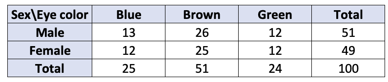

```{css, echo=FALSE}
.red { color: red; }
.blue { color: #378C95; }
strong { color: red; }
a { color: #378C95; font-weight: bold; }
.remark-inline-code { font-weight: 900; background-color: #a7d5e7; }
.caption { color: #378C95; font-style: italic; text-align: center; }

.content-box { 
box-sizing: content-box;
background-color: #378C95;
/* Total width: 160px + (2 * 20px) + (2 * 8px) = 216px
Total height: 80px + (2 * 20px) + (2 * 8px) = 136px
Content box width: 160px
Content box height: 80px */
}

.content-box-green {
background-color: #d9edc2;
}

.content-box-red {
background-color: #f9dbdb;
}

.fullprice {
text-decoration: line-through;
}
```

```{r xaringan-themer, include=FALSE, warning=FALSE}
library(xaringanthemer)
library(knitr)
library(granatlib)
library(emo)
style_mono_accent(
  base_color = "#DC322F",               # bright red
  inverse_background_color = "#002B36", # dark dark blue
  inverse_header_color = "#378C95",     # light aqua green
  inverse_text_color = "#FFFFFF",       # white
  title_slide_background_color = "var(--base)",
  text_font_google = google_font("Kelly Slab"),
  header_font_google = google_font("Oleo Script")
)

xaringanExtra::use_panelset()
xaringanExtra::html_dependency_clipboard()
xaringanExtra::html_dependency_scribble(pen_color = "#378C95", 3, 4)
xaringanExtra::use_tile_view()
```

```{r setup, include=FALSE}
options(htmltools.dir.version = FALSE)
knitr::opts_chunk$set(echo = FALSE, fig.align = "center", error = TRUE)
```


# Today's .blue[Agenda]

### Session 1 - Pairwise "correlation" methods

1. Contingency `r ji("bar_chart")`

2. Pearson 

3. Variance analysis

### Session 2 - Introduction to .fullprice[Multi]Tidyverse `r ji("earth")`


2. {dplyr} `r ji("tool")`

3. {tidyr} `r ji("broom")`

4. {stringr} `r ji("abc")`

5. {forcats} `r ji("cat")`

6. {purrr} `r ji("infinity")`

---

# Why do bivariate comparisons?

--

Remember:

> The entire statistical methodology runs through an **information-compressing approach**.

--

- In the case of a correlation calculation, we want to express whether, based on our knowledge of one variable, we can predict/assume st. about other variable

--

- In the case of scientific research, it is always part of the Exploratory Data Analysis (EDA)

--

  - Gives good initial ideas about what you should investigate more detailed

--
  
  - Often can be well interpreted and can be a "good story"

--
    
- Most of advanced methods rely on correlation or variance analysis (OLS, PCA, Clustering, ...)

---

# Contingency correlation

- This type of comparison can be applied if you have two nominal attributes [(RECALL)](https://marcellgranat.github.io/big_data2022/introduction-to-statistics.html#13)

--

- Thus this method relies on counting the equal and differing values
  
--

#### An illustrative example - .blue[Is there a relationship?]

```{r}
include_graphics("correlation_files/contingency_wiki.png")
```

???

source of table: https://en.wikipedia.org/wiki/Contingency_table

---

## Extreme examples

.blue[Is there a relationship?]

```{r}

```

--

.blue[Is there a relationship?]

```{r}
include_graphics("correlation_files/contingency2.png")
```

*Rule of thumb* `r ji("+1")` There is a relationship if the relative frequencies of the answers to the questions differ significantly by rows or columns.

---

### How to quantify the strength of the relationship?

--

- We will use the marginal distributions: the relative **frequency distribution** of the row column column variable in the contingency table.

The contingency table:

```{r}
include_graphics("correlation_files/contingency3.png")
```

--

.blue[Step 1.] Calculate the frequency assuming independence.

```{r}

```

---

### How to quantify the strength of the relationship?

.blue[Step 2.] Calculate the relative frequency assuming independece.


