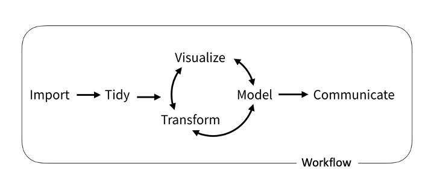
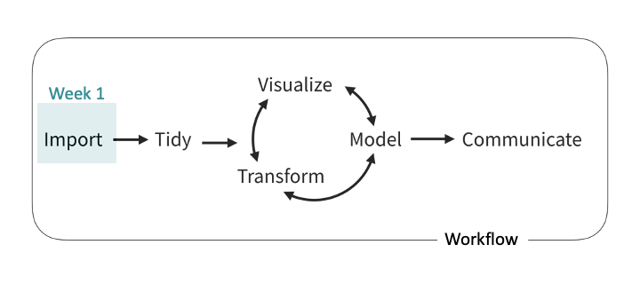
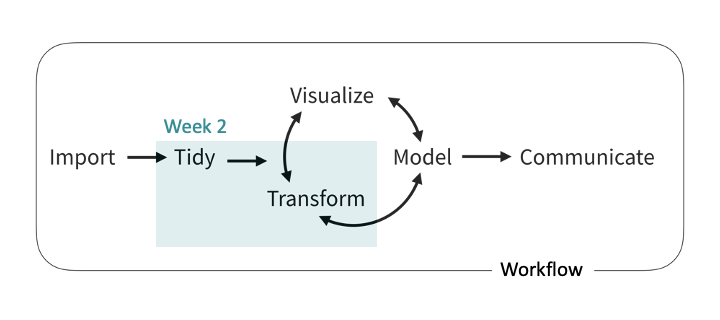
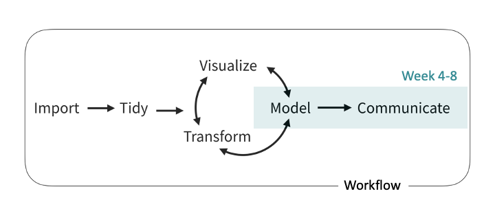
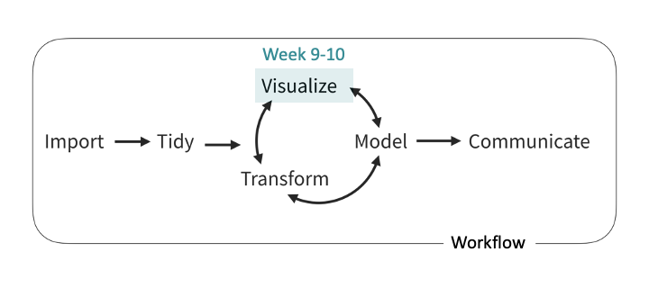

# Course description

> In the digital era, an abundant amount of data is created every day, which contains valuable information about the economy, but their proper handling is not trivial. Data analysis and visualization have now become one of the most important skills in business, but in the world of research, it is clearly the most important.

--

This course introduces several statistical and visualization methods that are **minimum requirements** for your later work (and studies), such as **descriptive statistics, inferential statistics and regression**. In addition, we will put a lot of effort into helping you to use **statistical programming languages** (properly) to be able to apply these tools in practice.

```{css, echo=FALSE}
.red { color: red; }
.blue { color: #378C95; }
strong { color: red; }
a { color: #378C95; font-weight: bold; }
.remark-inline-code { font-weight: 900; background-color: #a7d5e7; }
```

```{r xaringan-themer, include=FALSE, warning=FALSE}
library(xaringanthemer)
library(tidyverse)
library(emo)
style_mono_accent(
  base_color = "#DC322F",               # bright red
  inverse_background_color = "#002B36", # dark dark blue
  inverse_header_color = "#378C95",     # light aqua green
  inverse_text_color = "#FFFFFF",       # white
  title_slide_background_color = "var(--base)",
  text_font_google = google_font("Kelly Slab"),
  header_font_google = google_font("Oleo Script")
)

xaringanExtra::use_panelset()
xaringanExtra::html_dependency_clipboard()
xaringanExtra::html_dependency_scribble(pen_color = "#378C95", 3, 4)
xaringanExtra::use_tile_view()
```

---

# Course Objectives

At the end of the course, students: 
- are familiar **explanatory** data analysis

- understand probability theories and **inferential statistics**

- are able to *properly* apply **econometric models**

- can use **R** for their analytical tasks including complex **visualisations**

- are familiar with **Stata** and **Python**

```{r setup, include=FALSE}
options(htmltools.dir.version = FALSE)
```

--

## Course Materials

The main materials are **lecture slides** that are uploaded at the latest a day ahead of each session (you may "*print them to PDF*" if that helps). At some specific sessions (Stata and Python sessions) slides will not be available, the required material in these cases will be marked later.

---

class: middle, center

# Agenda

```{r echo=FALSE}

```


---

class: middle, center

# Agenda

```{r echo=FALSE}

```


---

class: middle, center

# Agenda

```{r echo=FALSE}

```


---

class: middle, center

# Agenda

```{r echo=FALSE}

```


---

class: middle, center

# Agenda

```{r echo=FALSE}

```

---


# About your teacher

- Marcell Granát, [granat.marcell@uni-neumann.hu](mailto:granat.marcell@uni-neumann.hu)

- PhD student at ELTE, research topic: Asset pricing and inflation

- The slides and my current research activities will be accessible at: [https://www.marcellgranat.com](https://www.marcellgranat.com)

- Find me if you are planning to write your TDK project on one of the following topics:

  - Text analysis: sentiment analysis, topic models
  - Inflation: hedonic price indexes, nowcasting, online inflation

--

- Do not hesitate to contact me if you have any issues related to statistics or R programming

---

# What about you? 

--

## Assessment

1. You are expected to attend the courses `r ji("man_student")`

--

1. **Four assignments** during the semester *60 points*

1. Written final **exam** *40 points*

1. 30 points from the assignments are a minimum requirement to pass!

--

| Points | Grade |
|:------:|:-----:|
| 90-100 |   5   |
| 80-89  |   4   |
| 66-79  |   3   |
| 50-65  |   2   |
|  0-49  |   1   |

???

Expert math knowledge is not a prior expectation to pass this course

---

# Recommended reading

```{r, print_refs, results='asis', echo=FALSE, warning=FALSE, message=FALSE}
library(RefManageR)
bib <- ReadBib("./course-outline.bib", check = FALSE)

print(bib, 
  .opts = list(check.entries = FALSE, 
               style = "html", 
               bib.style = "authoryear"))
```

--

- [R for Data Science](https://r4ds.had.co.nz) is strongly recommended if you do have experience with R!

---

class: center, middle

# Thank you for your attention!

Slides are available at [https://www.marcellgranat.com](https://www.marcellgranat.com)
