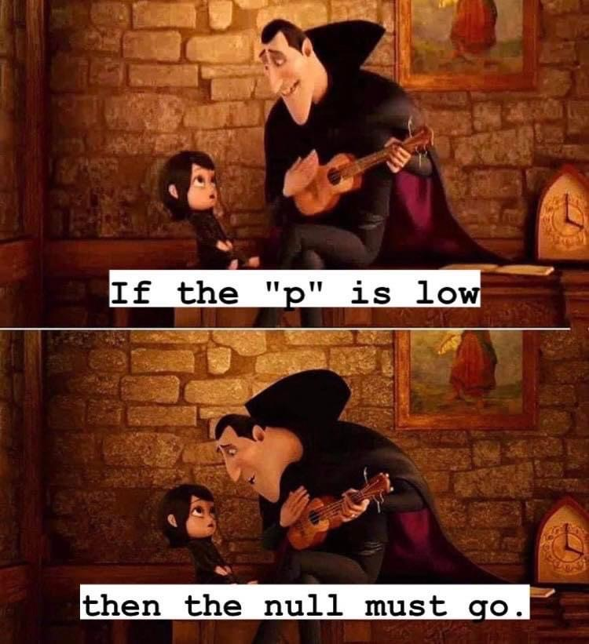
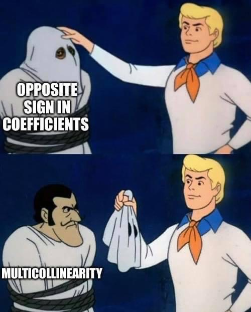

```{css, echo=FALSE}
.red { color: red; }
.blue { color: #378C95; }
strong { color: red; }
a { color: #378C95; font-weight: bold; }
.remark-inline-code { font-weight: 900; background-color: #a7d5e7; }
.caption { color: #378C95; font-style: italic; text-align: center; }

.content-box { 
box-sizing: content-box;
background-color: #378C95;
/* Total width: 160px + (2 * 20px) + (2 * 8px) = 216px
Total height: 80px + (2 * 20px) + (2 * 8px) = 136px
Content box width: 160px
Content box height: 80px */
}

.content-box-green {
background-color: #d9edc2;
}

.content-box-red {
background-color: #f9dbdb;
}

.fullprice {
text-decoration: line-through;
}
```

```{r xaringan-themer, include=FALSE, warning=FALSE}
library(xaringanthemer)
library(knitr)
library(granatlib)
library(emo)
library(magrittr)
library(tidyverse)
library(patchwork)
style_mono_accent(
  base_color = "#DC322F",               # bright red
  inverse_background_color = "#002B36", # dark dark blue
  inverse_header_color = "#378C95",     # light aqua green
  inverse_text_color = "#FFFFFF",       # white
  title_slide_background_color = "var(--base)",
  text_font_google = google_font("Kelly Slab"),
  header_font_google = google_font("Oleo Script")
)

xaringanExtra::use_panelset()
xaringanExtra::html_dependency_clipboard()
xaringanExtra::html_dependency_scribble(pen_color = "#378C95", 3, 4)
xaringanExtra::use_tile_view()
```

```{r setup, include=FALSE}
options(htmltools.dir.version = FALSE)
options(htmltools.dir.version = FALSE)
knitr::opts_chunk$set(echo = FALSE,
                      fig.align = "center", 
                      error = TRUE,
                      message = F,
                      out.width = "700px",
                      fig.width = 7,
                      fig.height = 4.5, 
                      out.height = "450px",
                      dpi = 400,
                      warning = FALSE)
```

# Today's .blue[Agenda]

### Session 1 - The OLS

### Session2 - Multivariate models

---

class: inverse, middle, center

# The concept

---

## What is econometrics?

> "The application of **statistical and mathematical methods** to the analysis of **economic** data, with the purpose
of giving **empirical content** to economic theories and verifying them or refuting them."

--

```{r out.height="300px"}
DiagrammeR::mermaid('
graph LR
  A(Research question)-->B(Data collection)
  A-->C(Formulate the model)
  B-->D(Model estimation)
  C-->D
  D-->E(Testing the model)
  E-.re-estimation.->D
  E-->F(Policy decision)
  E-->G(Prediction)
')
```

--

A prominent tool: **regression** 

---

class: inverse, middle, center

# Bivariate OLS

---

## Basics of OLS

### Amsterdam house data

```{r eval=FALSE, echo=TRUE}
amsterdam_house_df <- read_rds("https://raw.githubusercontent.com/MarcellGranat/big_data2022/main/econometrics_files/amsterdam_house.rds")
# source: https://www.kaggle.com/datasets/thomasnibb/amsterdam-house-price-prediction
```


```{r echo=FALSE}
amsterdam_house_df <- read_rds("econometrics_files/amsterdam_house.rds")
```

```{r}
amsterdam_house_df
```

---

## Basics of OLS

.blue[What price do we expect, knowing the area of a given house?]

Approach: ???

```{r}
p <- amsterdam_house_df %>% 
  ggplot(aes(Area, Price)) + 
  geom_point() + 
  ylim(0, 6e6)

p
```

---

### Amsterdam house data

.blue[What price do we expect, knowing the area of a given house?]

Approach: Let's fit a straight line.

```{r}
p + geom_smooth(method = "lm", se = FALSE)
```

---

## Basics of OLS

.blue[What parameters do we have to know to draw the line?]

$$Y_i = \beta_0 + \beta_1 \times X_i,$$

.pull-left[

where

$$Y_i = \text{The price of a given house}$$

$$\beta_0 = \text{The intercept of the line}$$

$$\beta_1 = \text{The slope of the line}$$

$$X_i = \text{The area of the given house}$$
]

---

## Basics of OLS

.blue[What parameters do we have to know to draw the line?]

$$Y_i = \beta_0 + \beta_1 \times X_i + \epsilon_i,$$

.pull-left[


where

$$Y_i = \text{The price of a given house}$$

$$\beta_0 = \text{The intercept of the line}$$

$$\beta_1 = \text{The slope of the line}$$

$$X_i = \text{The area of the given house}$$

$$\epsilon_i = \text{The error term}$$

]

.pull-right[

```{r out.height="260px", out.width="260px"}

```

]

--

### How to choose the value of the intercept and the slope?

--

.blue[Minimize the error?]

--

The result would be a line above the points...

---

## Basics of OLS

.blue[What parameters do we have to know to draw the line?]

$$Y_i = \beta_0 + \beta_1 \times X_i + \epsilon_i,$$

.pull-left[


where

$$Y_i = \text{The price of a given house}$$

$$\beta_0 = \text{The intercept of the line}$$

$$\beta_1 = \text{The slope of the line}$$

$$X_i = \text{The area of the given house}$$

$$\epsilon_i = \text{The error term}$$

]

.pull-right[

```{r out.height="260px", out.width="260px"}

```

]

### How to choose the value of the intercept and the slope?


.blue[Minimize the squared error?]

--

Exactly, that is what OLS is about. OLS = Ordinary Least Squares

---

## Basics of OLS

#### Let's calculate the sum of squared errors assuming two random values for the intercept and the slope

```{r echo=TRUE}
b0 <- 1000
b1 <- 200

amsterdam_house_df %>% 
  transmute(
    Price,
    Area,
    fit = b0 + Area * b1,
    e = Price - fit,
    e2 = e^2
  ) %$% 
  sum(e2, na.rm = TRUE)
```

---

## Basics of OLS

#### Let's transform this into a function

```{r echo=TRUE}
sse <- function(b0 = 1000, b1 = 200) {
  amsterdam_house_df %>% 
    transmute(
      Price,
      Area,
      fit = b0 + Area * b1,
      e = Price - fit,
      e2 = e^2
    ) %$% 
    sum(e2, na.rm = TRUE)
}

sse(1000, 200)
```

---

## Basics of OLS

#### Let's apply the function on large set of values

```{r echo=TRUE, highlight.output=4}
sse_df <- crossing(
  b0 = seq(from = 0, to = 1e4, length.out = 100),
  b1 = seq(from = 0, to = 1e4, length.out = 100)
) %>% 
  mutate(
    sse = map2_dbl(b0, b1, sse)
  ) %>% 
  arrange(sse)

sse_df
```

---

## Basics of OLS

#### Let's apply the function on large set of values

```{r}
sse_df %>% 
  ggplot(aes(b0, b1, fill = sse)) + 
  geom_tile(color = "black") + 
  geom_point(aes(b0[which(sse == min(sse))], b1[which(sse == min(sse))]), color = "red") +
  theme(
    legend.position = "right"
  )
```


---

## Basics of OLS

Now we have run the function on 10,000 combination, but we are still not sure whether our solution is the best possible, or how far is it from that...

--

Fortunately, there is a much more efficient way to determine the line that produces the least squared errors

The normal equations:

$$\sum Y_i =n \times \beta_0+\beta_1 \sum X_i$$

$$\sum X_i Y_i =\beta_0 \sum X_i+\beta_1 \sum X_i^2$$

---

## Basics of OLS

In our case:

```{r echo=TRUE}
amsterdam_house_df %>% 
  drop_na(Price, Area) %>% 
  summarise(n = n(), y = sum(Price), x = sum(Area), 
            xz = sum(Price * Area), x2 = sum(Area^2))
```

```{r}
amsterdam_house_df %>% 
  drop_na(Price, Area) %>% 
  summarise(n = n(), y = sum(Price), x = sum(Area), 
            xy = sum(Price * Area), x2 = sum(Area^2)) %>% 
  mutate_all(~ format(., big.mark = ",")) %>% 
  iwalk(~ assign(x = .y, value = .x, envir = globalenv()))
```

$$`r y` =`r n` \times \beta_0+\beta_1 \times `r x`$$

$$`r xy` =\beta_0 \times `r x`+\beta_1 \times `r x2`$$

---

## Basics of OLS

Of course, there are a simpler solution for fitting a **L**inear **M**odel

```{r echo=TRUE}
lm(formula = Price ~ Area, data = amsterdam_house_df)
```

--

How to interpret the results?

1. A house with one additional m^2 in the area would cost € 7918 more

2. If the area would be zero, the price would be - 134910 (both parts are impossible, this is just a meaningless extrapolation)

Now we see the estimated coefficients (beta values), but what else can we extract?

---

## Basics of OLS

The old-school (and disadvantageous) method

```{r echo=TRUE}
fit <- lm(formula = Price ~ Area, data = amsterdam_house_df)
summary(fit)
```

---

## Basics of OLS

The tidy method: {broom}

```{r echo=TRUE}
library(broom)
augment(fit)
```

---

## Basics of OLS

The tidy method: {broom}

```{r echo=TRUE}
library(broom)
glance(fit)
```

---

## Basics of OLS

The tidy method: {broom}

```{r echo=TRUE}
library(broom)
tidy(fit)
```

.content-box-green[
The estimated coefficients have a standard error!
]

--

And yes, they have a **confidence interval** as well.

```{r}
tidy(fit, conf.int = TRUE, conf.level = .95)
```


---

## Basics of OLS

```{r echo=TRUE}
coef_df <- tidy(fit, conf.int = TRUE, conf.level = .95)
```

```{r}
p +
  geom_abline(intercept = coef_df$conf.low[1], slope = coef_df$estimate[2], color = "red3", lty = 2) +
  geom_abline(intercept = coef_df$conf.high[1], slope = coef_df$estimate[2], color = "red3", lty = 2) +
  geom_smooth(method = "lm", se = FALSE) +
  labs(title = "conf.int implied by the intercept")
```

---

```{r}
p +
  geom_abline(intercept = coef_df$estimate[1], slope = coef_df$conf.low[2], color = "red3", lty = 2) +
  geom_abline(intercept = coef_df$estimate[1], slope = coef_df$conf.high[2], color = "#378C95", lty = 2) +
  geom_smooth(method = "lm", se = FALSE) +
  labs(title = "conf.int implied by the slope")
```

---

```{r}
p +
  geom_smooth(method = "lm", se = TRUE) +
  labs(title = "conf.int implied by the intercept and the slope")
```

---

### What is the standard error of the coef?

Let's create a function for the data-generating process (DGP), where coefficients can be specified.

```{r echo=TRUE}
dgp <- function(b0 = 100, b1 = 20, n = 100) {
  tibble(x = rnorm(n, sd = 3)) %>% 
    mutate(y = b0 + b1 * x + rnorm(n, sd = 25))
}
```

Let's generate several trajectories with that.

```{r echo=TRUE}
tibble(data = rerun(5, dgp()))
```


---

### What is the standard error of the coef?

```{r echo=TRUE}
rerun(1e3, dgp()) %>% # 1000 generated trajectory
  tibble(data = .) %>% 
  mutate(
    # the model
    fit = map(data, function(xx) lm(formula = y ~ x, data = xx)), 
    tidied = map(fit, broom::tidy), # coeffients
    estimate = map(tidied, pull, 2), # estimation of the coef
    se = map(tidied, pull, 3), # SE of the coefs
    b0 = map_dbl(estimate, 1),
    b1 = map_dbl(estimate, 2),
    se_b0 = map_dbl(se, 1),
    se_b1 = map_dbl(se, 2),
  ) %>% 
  summarise(
    mean(se_b0), # mean of the estimated SEs
    sd(b0), # sd of the point estimates
    mean(se_b1), # mean of the estimated SEs
    sd(b1), # sd of the point estimates
  )
```

---

#### What is the standard error of the coef?

```{r, animation.hook='gifski'}
rerun(20, dgp(n = 25)) %>% 
  tibble(data = .) %>% 
  mutate(
    fit = map(data, ~ lm(formula = "y ~ x", data = .)),
    map_df(fit, coefficients),
    p = map(data, ~ {
      ggplot(.) +
        aes(x, y) +
        geom_vline(xintercept = 0, lty = 2) +
        geom_point(alpha = .5) +
        geom_smooth(method = "lm", se = FALSE, fullrange = TRUE) +
        xlim(-7, 7) +
        ylim(-100, 300)
    }),
    l = map2_chr(`(Intercept)`, x, ~ str_c("intercept: ", format(.x, digits = 6), ", slope: ", format(.y, digits = 6))),
    p = map2(p, l, ~ .x + ggtitle(.y))
  ) %>% 
  arrange(x) %>% 
  pull(p) %>% 
  walk(print)
```

The visualization above shows the simulated data points with the previously created `dgp`. It can be seen that due to the random terms, the intercept and the slope will be slightly different for each trajectory. The standard deviations of the estimated parameters are the standard errors.

---
## Basics of OLS

In the table containing the coefficients, a test statistic and a p-value are listed next to each term What hypothesis do they belong to?

--

$$H_0: \beta_j=0$$

--

How do we make a decision based on the p-value?

--


.pull-left[
```{r out.height="250px", out.width="250px"}

```
]

.pull-right[
**If the p-value is lower than the significance level (alpha), then we reject the null hypothesis.**

]

--

.blue[And what is the probability of committing a type I error?]

--

Alpha.

---

### Type I error in regression

Let's run the previously created dgp function, but set b1 to 0. How often is the H0 rejected?

```{r echo=TRUE}
tibble(data = rerun(1e3, dgp(b1 = 0))) %>% 
  mutate(
    fit = map(data, function(xx) lm(formula = y ~ x, data = xx)),
    tidied = map(fit, broom::tidy),
    pvalues = map(tidied, pull),
    b1_p = map_dbl(pvalues, 2)
  ) %>% 
  summarise(rate_type1 = sum(b1_p < .05) / n())
```

---

class: inverse, middle, center

# Multivariate regression

---

## Multivariate regression

- Let's say that Y does not only depend on one variable

--

- For instance, price can be determined based on the area size and the number of rooms


$$Y_i = \beta_0 + \beta_1 \times X_{i, 1} + \beta_2 \times X_{i, 2} + \epsilon_i,$$
where

$$X_i,2 = \text{The number of the rooms}$$
- Sure we could try to "find" the optimal coefficients as presented at the bivariate case, but the number of possibilities (infinity) increased a lot...

- The mathematical background of solving the minimization problem requires the knowledge of algebra

---

## Visualisation

```{r}
amsterdam_house_df %>% 
plotly::plot_ly(
  x= ~Area,
  y= ~Room,
  z= ~Price,
  sizemode= 'absolute',
  sizeref= .4
)
```

---

## Multivariate regression

.content-box-red[This is not covered by the course!]

$$\mathbf{y}=\left[\begin{array}{c} y_1 \\ y_2 \\ \vdots \\ y_n \end{array}\right], \quad \mathbf{X}=\left[\begin{array}{ccccc} 1 & x_{11} & x_{21} & \ldots & x_{k 1} \\ 1 & x_{12} & x_{22} & \ldots & x_{k 2} \\ \vdots & \vdots & \vdots & \ddots & \vdots \\ 1 & x_{1 n} & x_{2 n} & \ldots & x_{k n} \end{array}\right], \quad \boldsymbol{\beta}=\left[\begin{array}{c} \beta_0 \\ \beta_1 \\ \vdots \\ \beta_k \end{array}\right], \:\:\:\;  \boldsymbol{\varepsilon}=\left[\begin{array}{c} \varepsilon_1 \\ \varepsilon_2 \\ \vdots \\ \varepsilon_n \end{array}\right]$$

$$\mathbf{e}^{\mathrm{T}} \mathbf{e}=(\mathbf{y}-\mathbf{X} \hat{\boldsymbol{\beta}})^{\mathrm{T}}(\mathbf{y}-\mathbf{X} \hat{\boldsymbol{\beta}})$$

$$\hat{\boldsymbol{\beta}}=\left(\mathbf{X}^{\mathrm{T}} \mathbf{X}\right)^{-1} \mathbf{X}^T \mathbf{y}$$

---

## Multivariate regression

.pull-left[

Fortunately, our work did not become more difficult in R.
]

.pull-right[
```{r out.height="200px", out.width="200px"}

```

]

```{r echo=TRUE}
fit <- lm(formula = Price ~ Area + Room, data = amsterdam_house_df)

fit
```

---

## Multivariate regression

```{r}
fit
```

.blue[Can this result be interpreted as if a house has more rooms, it is cheaper?]

--

Of course not.

```{r out.height="250px", out.width="315px"}

```

---

## Multivariate regression

#### Multicollinearity

```{r}
amsterdam_house_df %>% 
  select(Price, Area, Room) %>% 
  GGally::ggpairs()
```

---

```{r echo=TRUE}
form <- c("Price ~ Area", "Price ~ Area + Room", "Price ~ Room", 
          "Area ~ Room", "Room ~ Area"
)
```

```{r echo=TRUE}
tibble(form) %>% 
  mutate(
    fit = map(form, lm, data = drop_na(
      amsterdam_house_df, 
      Price, Area, Room)
    ),
    tidied = map(fit, broom::tidy)
  ) %>% 
  unnest(tidied) %>% 
  select(form, term, estimate) %>% 
  pivot_wider(names_from = term, values_from = estimate)
```

---

.pull-left[


```{r out.height="450px", out.width="700px"}
DiagrammeR::mermaid("
  graph TD
  A(Room)-.29.2.->B(Area)
  A-->|-51009.|C(Price)
  B-->|29.2*9057|C
                    
                    ", width = 700, height = 400)
```

]

.pull-right[
$$\text{Total effect} = \text{direct effect} + \text{indirect effect}$$
$$213895 = 29.2 \times 9057 - 51009$$
]

#### Path analysis

1. .blue[Total effect: ]If we want to buy a house with one additional room, it is expected to cost 213,895 euros more.

2. .blue[Indirect effect: ]A house with 1 additional room would be expected to be 29.2 square meters larger, and the average price per square meter is 9,057 euros.

3. .blue[Direct effect: ] If we compare houses with exactly the same area size, then the one with one extra room would cost 51009 euros less.

---

## Type I error in multivariate model

Let's create a function for a new DGP wtih two regressors.

```{r echo=TRUE}
dgp_multi <- function(b0 = 100, b1 = 0, b2 = 0, n = 100) {
    tibble(x1 = rnorm(n, sd = .8), x2 = rnorm(n, sd = 5)) %>% 
    mutate(y = b0 + b1 * x1 + b2 * x2 + rnorm(n))
  }

dgp_multi()
```

---

## Type I error in multivariate model

```{r echo=TRUE}
tibble(data = rerun(1e3, dgp_multi())) %>% 
  mutate(
    fit = map(data, function(xx) lm(y ~ x1 + x2, data = xx)),
    tidied = map(fit, broom::tidy),
    pvalues = map(tidied, pull),
    p_b1 = map_dbl(pvalues, 2),
    p_b2 = map_dbl(pvalues, 3),
    error_commited = p_b1 < .05 | p_b2 < .05
  ) %>% 
  summarise(sum(error_commited) / n())
```

--

We run two test at each model!

At each the probability of commiting a type I error is 5%. 

--

The joint probability to not commit type I error is:

$$1 - .95 \times .95 = 0.0975$$

---

## Type I error in multivariate model

As more and more variables are included in the model, the probability of making a type 1 error increases. 

--

In the case of many variables, even if the outcome variable is not related to any of them, we will still find a significant parameter.

.blue[Solution:] F-test

---

## F-test

.pull-left[
$$F=\frac{(\mathrm{RRSS}-\mathrm{URSS}) / r}{\mathrm{URSS} /(n-k-1)}$$

where

URSS = unrestricted residual sum of squares

RSSS = restricted residual sum of squares obtained by imposing the restrictions of the hypothesis

r = number of restrictions imposed by hypothesis

]

.pull-right[
```{r out.height="300px", out.width="240px"}

```
]

Testing whether the explanatory variables jointly explain the variance significantly:

$$\beta_1=\beta_2=\cdots=\beta_k=0$$

---

## F-test


.pull-left[

- The F distribution takes only positive values

- Always "greater" alternative

- Mainly report only the p-value
]

.pull-rigth[
```{r out.height="175px", out.width="300px"}
ggplot(data.frame(x = c(-10, 10)), aes(x=  x)) +
  geom_function(fun = "df", args = list(df1 = 2, df2 = 917)) +
  labs(title = "Density function of the F distribution (2, 927)", x = NULL, y = NULL)
```

]

```{r echo=TRUE}
broom::glance(fit)
```

---

class: center, middle

# Thank you for your attention!

Slides are available at [www.marcellgranat.com](https://www.marcellgranat.com)

