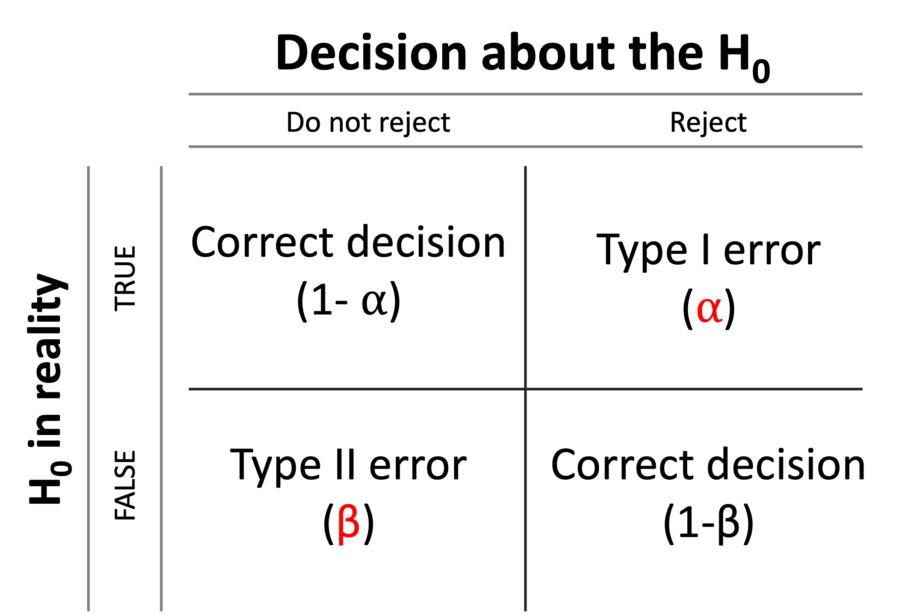

```{css, echo=FALSE}
.red { color: red; }
.blue { color: #378C95; }
strong { color: red; }
a { color: #378C95; font-weight: bold; }
.remark-inline-code { font-weight: 900; background-color: #a7d5e7; }
.caption { color: #378C95; font-style: italic; text-align: center; }

.content-box { 
box-sizing: content-box;
background-color: #378C95;
/* Total width: 160px + (2 * 20px) + (2 * 8px) = 216px
Total height: 80px + (2 * 20px) + (2 * 8px) = 136px
Content box width: 160px
Content box height: 80px */
}

.content-box-green {
background-color: #d9edc2;
}

.content-box-red {
background-color: #f9dbdb;
}

.fullprice {
text-decoration: line-through;
}
```

```{r xaringan-themer, include=FALSE, warning=FALSE}
library(xaringanthemer)
library(knitr)
library(granatlib)
library(emo)
library(magrittr)
library(tidyverse)
library(patchwork)
style_mono_accent(
  base_color = "#DC322F",               # bright red
  inverse_background_color = "#002B36", # dark dark blue
  inverse_header_color = "#378C95",     # light aqua green
  inverse_text_color = "#FFFFFF",       # white
  title_slide_background_color = "var(--base)",
  text_font_google = google_font("Kelly Slab"),
  header_font_google = google_font("Oleo Script")
)

xaringanExtra::use_panelset()
xaringanExtra::html_dependency_clipboard()
xaringanExtra::html_dependency_scribble(pen_color = "#378C95", 3, 4)
xaringanExtra::use_tile_view()
```

```{r setup, include=FALSE}
options(htmltools.dir.version = FALSE)
options(htmltools.dir.version = FALSE)
knitr::opts_chunk$set(echo = FALSE,
                      fig.align = "center", 
                      error = TRUE,
                      message = F,
                      out.width = "700px",
                      fig.width = 7,
                      fig.height = 4.5, 
                      out.height = "450px",
                      dpi = 400,
                      warning = FALSE)
```

# Today's .blue[Agenda]

### Session (1-2) - Inferential statistics II.

1. IID mean estimation II.

2. Concepts of hypothesis testing

3. Hypothesis testing in R

4. One-sample testing

5. Two-sample tests

6. Multiple-sample tests

---

class: inverse, middle, center

# IID mean estimation II.

---
## An illustrative example

Let's continue where we stopped!

--

A machine extracts coffee into the bottles. It is known from previous data recordings that the weight loaded by the machine is a random variable with a normal distribution, with a standard deviation of 1.5 g.
The weight (g) of the coffee granules in the bottles in the 16-element sample taken to check the accuracy of the machine:

55, 54, 54, 56, 57, 56, 55, 57, 54, 56, 55, 54, 57, 54, 56, 50.

#### Let!s calculate the 95% confidence interval to the expected weight.

---
## An illustrative example

Let's continue where we stopped!

A machine extracts coffee into the bottles. It is known from previous data recordings that the weight loaded by the machine is a random variable with a normal distribution, **with a standard deviation of 1.5 g.**
The weight (g) of the coffee granules in the bottles in the 16-element sample taken to check the accuracy of the machine:

55, 54, 54, 56, 57, 56, 55, 57, 54, 56, 55, 54, 57, 54, 56, 50.

#### Let!s calculate the 95% confidence interval to the expected weight.

--

.blue[Why did we need to know the variance in the population?]

--

#### Let!s calculate the 95% confidence interval to the expected weight assuming that we have no prior information about the standard deviation.

In this case, there is another uncertainty factor in the calculation. We also **estimate the standard deviation** for drawing the distribution.

---

## Mean estimation with an unknown standard deviation

Mean point estimation:

$$
\bar{x}=\frac{1}{n} \sum_{i=1}^n x_i
$$

SD estimation:

$$
s^2=\frac{1}{n-1} \sum_{i=1}^n\left(x_i-\bar{x}\right)^2
$$
Then the **Student T-distribution** can be derived as:

$$
t(n-1)=\frac{\bar{x}-\mu}{\sigma / \sqrt{n}},
$$

where $\mu$ denotes the population mean and $\sigma$ denotes the standard deviation of the population.

---

## The Student T-distribution

$$
t(n-1)=\frac{\bar{x}-\mu}{S / \sqrt{n}},
$$

where $n-1$ is called as the degree of freedom.

--

```{r out.height="400px"}
t_dist <- function(df = 1:3) {
  p <- ggplot()
  
  for (i in df) {
    p <- p + geom_function(data = tibble(x = c(-5, 5), color = i), mapping = aes(x, color = color), fun = dt, args = list(df = i)) +
      geom_label(data = data.frame(x = 0, y = dt(0, i), label = str_c("df=",i)), aes(x, y, label = label))
  }
  p
}

t_dist(c(1, 3, 30, 100)) +
  labs(x = NULL, y = NULL, color = "Degree of freedom\n(n-1)", 
       alpha = NULL) + 
  scale_alpha_manual(values = .8) +
  scale_color_gradient(guide = guide_colorsteps()) +
  theme_minimal()
```

---

## The Student T-distribution

$$
t(n-1)=\frac{\bar{x}-\mu}{S / \sqrt{n}},
$$

where $n-1$ is called the degree of freedom.

```{r out.height="400px"}
t_dist <- function(df = 1:3) {
  p <- ggplot()
  
  for (i in df) {
    p <- p + geom_function(data = tibble(x = c(-5, 5), color = i), mapping = aes(x, color = color), fun = dt, args = list(df = i)) +
      geom_label(data = data.frame(x = 0, y = dt(0, i), label = str_c("df=",i)), aes(x, y, label = label))
  }
  p
}

t_dist(c(1, 3, 30, 100)) +
  geom_function(fun = dnorm, color = "#f7c34a", size = 2, mapping = aes(alpha = "St normal"))  +
  labs(x = NULL, y = NULL, color = "Degree of freedom\n(n-1)", 
       alpha = NULL) + 
  scale_alpha_manual(values = .8) +
  scale_color_gradient(guide = guide_colorsteps()) +
  theme_minimal()
```

---

## An illustrative example

#### Let!s calculate the 95% confidence interval to the expected weight assuming that we have no prior information about the standard deviation.

--

Confidence interval:

$$\bar{x} \pm t_{97.5}(n-1)\frac{s}{\sqrt{n}}$$

--

```{r echo=TRUE}
y <-c(55, 54, 54, 56, 57, 56, 55, 57, 54, 56, 55, 54, 57, 54, 56, 50)
mean(y)
```

```{r echo=TRUE}
qt(.975, df = length(y) - 1)
```

```{r echo=TRUE}
sd(y) # divided by n - 1 !!!
```

---

## An illustrative example

#### Let!s calculate the 95% confidence interval to expected weight assuming that we have no prior information about the standard deviation.

Confidence interval:

$$\bar{x} \pm t_{97.5}(n-1)\frac{s}{\sqrt{n}} = 55 \pm 2.1315\frac{1.7512}{\sqrt{16}} = (54.07, 55.93)$$

--

```{r echo=TRUE}
y <-c(55, 54, 54, 56, 57, 56, 55, 57, 54, 56, 55, 54, 57, 54, 56, 50)
mean(y)
```

```{r echo=TRUE}
qt(.975, df = length(y) - 1)
```

```{r echo=TRUE}
sd(y) # divided by n - 1 !!!
```

---


## The probability function

The daily payment amount in a bank follows a normal distribution, with parameters $\mu$=HUF 3.6 million, $\sigma$=HUF 0.9 million.

#### What is the probability that on a given day the payment amount is ...

--

##### 1. below HUF 3 million?

```{r echo=TRUE}
pnorm(q = 3, mean = 3.6, sd = .9)
```

```{r out.height="270px", fig.height=2.7}
ggplot(data = tibble(x = c(-2.5, 8))) + 
  aes(x) +
  geom_function(fun = pnorm, args = list(mean = 3.6, sd = .9)) + 
  geom_line(data = tibble(x = c(3, 3), y = c(- Inf, pnorm(q = 3, mean = 3.6, sd = .9))), aes(x, y), color = "red2") +
  geom_line(data = tibble(x = c(-Inf, 3), y = c(pnorm(q = 3, mean = 3.6, sd = .9), pnorm(q = 3, mean = 3.6, sd = .9))), aes(x, y), color = "red2") +
  labs(x = "q", y = "pnorm") +
  theme_minimal()
```


---

## The probability function

The daily payment amount in a bank follows a normal distribution, with parameters $\mu$=HUF 3.6 million, $\sigma$=HUF 0.9 million.

#### What is the probability that on a given day the payment amount is ...

##### 1. below HUF 3 million?

```{r echo=TRUE}
pnorm(q = 3, mean = 3.6, sd = .9)
```

--

##### 2. above HUF 5 million?

--

```{r echo=TRUE}
1 - pnorm(q = 5, mean = 3.6, sd = .9)
```

---

## The probability function

The daily payment amount in a bank follows a normal distribution, with parameters $\mu$=HUF 3.6 million, $\sigma$=HUF 0.9 million.

#### What is the probability that on a given day the payment amount is ...

##### 3. between HUF 2.7 and 4.5 million?

--

```{r echo=TRUE}
pnorm(q = 4.5, mean = 3.6, sd = .9) -
  pnorm(q = 2.7, mean = 3.6, sd = .9)
```

---

## The probability function

The daily payment amount in a bank follows a normal distribution, with parameters $\mu$=HUF 3.6 million, $\sigma$=HUF 0.9 million.

#### How much money should be kept in the bank if we want to ensure that payments can be performed with a 95% probability?

--

```{r echo=TRUE}
qnorm(p = .95, mean = 3.6, sd = .9)
```

--

```{r out.height="270px", fig.height=2.7}
ggplot(data = tibble(x = c(-2.5, 8))) + 
  aes(x) +
  geom_function(fun = pnorm, args = list(mean = 3.6, sd = .9)) + 
  geom_line(data = tibble(x = c(qnorm(p = .95, mean = 3.6, sd = .9), qnorm(p = .95, mean = 3.6, sd = .9)), y = c(- Inf, .95)), aes(x, y), color = "red2") +
  geom_line(data = tibble(x = c(-Inf, qnorm(p = .95, mean = 3.6, sd = .9)), y = c(.95, .95)), aes(x, y), color = "red2") +
  labs(x = "qnorm", y = "p") +
  theme_minimal()
```

---

class: inverse, middle, center

# Concepts of hypothesis testing

---

## Concepts of hypothesis testing

> Hypothesis test is a procedure that between the sample value and population value hypothesized is real or due to chance variation.

--

- The bank claims that the average daily payment is HUF 45 million, with a standard deviation of HUF 2 million.

--

- Yesterday it was HUF 42 million. Do you still believe to the bank?

--

- During a year-long observation, he finds that the average was only HUF 40 million. Do you still believe the statement?

???

Source: Maddala & Lahiri

---

## Concepts of hypothesis testing

Steps of hypothesis testing:

1. Set two disjunct hypotheses (only one can be true at once)

--

2. Derive a test statistics **based on the sample**

3. Make a decision about the .blue[null hypothesis]

---

## How to set the .blue[hypothesis]?

- The hypothesis we are testing is called the null hypothesis and is often denoted by **H0**.

- The alternative hypothesis is denoted by **H1**.

--

For instance,

$$H_0: \: \mu \ge 45 \: \text{against} \: H_1: \: \mu < 45$$

---

## How to calculate the .blue[test statistics]?

> The test statistic is a **number** calculated from a statistical test of a hypothesis. It shows **how closely your observed data match the distribution expected under the null hypothesis** of that statistical test.

--

Back to our example. Our sample (suppose that the s.d. is known):

$$\bar{x} = 44 \:\:\:\:\:\: \:\:\:\:\:\: n =365$$

--

$$z = \frac{\bar{x} - \theta}{\sigma/\sqrt{n}} =  \frac{44-45}{2/\sqrt{365}}=-9.5525$$

---

## How to calculate the .blue[test statistics]?

$$z = \frac{44-45}{2/\sqrt{365}}=-9.5525$$

```{r echo = TRUE}
pnorm(q = -9.5525, mean = 0, sd = 1)
pnorm(q = 44, mean = 45, sd = 2 / (365^.5))
```

--

> ... shows **how closely your observed data match the distribution expected under the null hypothesis**

If the population follows truly a distribution with HUF 45 million average and HUF 2 million standard deviation, then the probability of getting a sample with HUF 44 million average or less equals .blue[6.331001e-22] (approximately zero).


???

source: https://www.scribbr.com/statistics/test-statistic/

---

### An illustrative example

`rnorm`: random number generation for the normal distribution 

```{r}
set.seed(123)
```


```{r echo=TRUE}
mu <- 0
s <- 1
n <- 10
random_values <- rnorm(n = n, mean = mu, sd = s)

random_values

multiplier <- 1

random_values < mu - s * 1

random_values > mu + s * 1
```


---

### An illustrative example

```{r echo=TRUE}
r_interval <- function(mu = 0, s = 1, n = 10, multiplier = 1) {
  
  random_values <- rnorm(n = n, mean = mu, sd = s)
  
  out_interval <- (random_values < mu - s * multiplier) | # above or below
    (random_values > mu + s * multiplier)
  
  1 - sum(out_interval) / n # value to return
}
```

---

### An illustrative example

```{r echo=TRUE}
r_interval(mu = 0, s = 1, n = 10, multiplier = 1)
r_interval(mu = 0, s = 1, n = 10, multiplier = 1)
r_interval(mu = 0, s = 1, n = 10, multiplier = 1)
r_interval(mu = 0, s = 1, n = 10, multiplier = 1)
```

--

```{r echo=TRUE, highlight.output = 1}
r_interval(mu = 0, s = 1, n = 1000000, multiplier = 1)
```

---

### An illustrative example

The same result is always obtained in the case of a normal distribution, regardless of the mean and standard deviation.

```{r echo=TRUE}
r_interval(mu = 0, s = 1, n = 1000000, multiplier = 1)
r_interval(mu = 1, s = 1, n = 1000000, multiplier = 1)
r_interval(mu = 3, s = 5, n = 1000000, multiplier = 1)
r_interval(mu = 100, s = 15, n = 1000000, multiplier = 1)
r_interval(mu = -20, s = 40, n = 1000000, multiplier = 1)
```

---

### An illustrative example

```{r echo=TRUE}
r_interval(mu = 0, s = 1, n = 1000000, multiplier = 1)
r_interval(mu = 1, s = 1, n = 1000000, multiplier = 2)
r_interval(mu = 3, s = 5, n = 1000000, multiplier = 3)
```


```{r echo=TRUE}
r_interval(mu = 100, s = 15, n = 1000000, multiplier = 1.95)
r_interval(mu = -20, s = 40, n = 1000000, multiplier = 1.65)
```

---

### An illustrative example

- Even if HUF 44 million does not sound like a huge difference, if the s.d. in the sample equals 2, then the s.d. of the sample averages is 2 / 365^.5 = 0.1046848

- .1 \* 3 would also be a highly significant difference to not believe that the population mean is 45

- In general, the procedure is to assign a specific boundary (critical value) or boundaries, from which if the value of the test statistic falls further, then I reject the null hypothesis.

- Let's say that I want to reject if the probability of getting a sample average with that value or lower should be .blue[5%]. This is the **significance level**.

--                                                                    

```{r echo=TRUE}
qnorm(.05)
```

---

## How to set the .blue[hypothesis]?

#### Alternative: **less** (significance level (alpha) = 5%)

.pull-left[

$$H_0: \: \mu \ge 45 \: \text{against} \: H_1: \: \mu < 45$$
]

.pull-right[
```{r echo=TRUE}
qnorm(.05)
```

]

```{r out.height="350px", fig.height=3.5}
p1 <- ggplot(data = tibble(x = c(-5, 5))) +
  aes(x) +
  geom_function(fun = "pnorm") +
  geom_vline(xintercept = qnorm(.05), lty = 2) +
  labs(x = NULL, y = NULL, title = "Probability function") +
  theme_minimal()

p2 <- ggplot(data = tibble(x = c(-5, 5))) +
  aes(x) +
  geom_function(fun = "dnorm") +
  geom_vline(xintercept = qnorm(.05), lty = 2) +
  labs(x = NULL, y = NULL, title = "Density function") +
  theme_minimal()

p1 / p2
```

---

## How to set the .blue[hypothesis]?

#### Alternative: **greater** (significance level (alpha) = 5%)

.pull-left[

$$H_0: \: \mu \leq 45 \: \text{against} \: H_1: \: \mu > 45$$
]

.pull-right[
```{r echo=TRUE}
qnorm(.95)
```

]

```{r out.height="350px", fig.height=3.5}
p1 <- ggplot(data = tibble(x = c(-5, 5))) +
  aes(x) +
  geom_function(fun = "pnorm") +
  geom_vline(xintercept = qnorm(.95), lty = 2) +
  labs(x = NULL, y = NULL, title = "Probability function") +
  theme_minimal()

p2 <- ggplot(data = tibble(x = c(-5, 5))) +
  aes(x) +
  geom_function(fun = "dnorm") +
  geom_vline(xintercept = qnorm(.95), lty = 2) +
  labs(x = NULL, y = NULL, title = "Density function") +
  theme_minimal()

p1 / p2
```

---

## How to set the .blue[hypothesis]?

#### Alternative: **two sided** (significance level (alpha) = 5%)

.pull-left[

$$H_0: \: \mu = 45 \: \text{against} \: H_1: \: \mu \neq 45$$
]

.pull-right[
```{r echo=TRUE}
qnorm(c(.025, .975))
```

]

```{r out.height="350px", fig.height=3.5}
p1 <- ggplot(data = tibble(x = c(-5, 5))) +
  aes(x) +
  geom_function(fun = "pnorm") +
  geom_vline(xintercept = qnorm(c(.025, .975)), lty = 2) +
  labs(x = NULL, y = NULL, title = "Probability function") +
  theme_minimal()

p2 <- ggplot(data = tibble(x = c(-5, 5))) +
  aes(x) +
  geom_function(fun = "dnorm") +
  geom_vline(xintercept = qnorm(c(.025, .975)), lty = 2) +
  labs(x = NULL, y = NULL, title = "Density function") +
  theme_minimal()

p1 / p2
```

---

## Type I & type II errors

- If the null hypothesis is true, we take a random sample, and then the probability to reject incorrectly the H0 is alpha.

  - We call this Type I error

--

- What if the H0 is false in the reality?

Let's assume the following hypothesis:

$$H_0: \mu = 250 \:\:\:H_1: \mu \neq 250$$

- But we "know" that the real average is at 254!

$$S = 4, \:\:\:n = 10$$

---

## Type I & type II errors

```{r}
valid_dist <- function(x, m = 254, s = 4, n = 10) {
  dnorm(x = x, mean = m, sd = s / n^.5)
}

h0_dist <- function(x, m = 250, s = 4, n = 10) {
  dnorm(x = x, mean = m, sd = s / n^.5)
}

reject_h0 <- function(x, m = 250, s = 4, n = 10) {
  ((pnorm(x, mean = m, sd = s / n^.5) > .975) | (pnorm(x, mean = m, sd = s / n^.5) < .025)) *
    dnorm(x, mean = m, sd = s / n^.5)
}

beta_dist <- function(x, m0 = 250, mT = 254, s = 4, n = 10) {
  ((pnorm(x, mean = m0, sd = s / n^.5) <= .975) & (pnorm(x, mean = m0, sd = s / n^.5) >= .025)) *
    dnorm(x, mean = mT, sd = s / n^.5)
}

plotting_beta <- function(m0 = 250, mT = 254, s = 4, n = 10, ylim = c(0, .4)) {
  p <- ggplot(data = tibble(x = c(245, 260))) +
    aes(x) +
    geom_hline(yintercept = 0) +
    geom_function(fun = "valid_dist", args = list(m = mT, s = s, n = n)) +
    stat_function(fun = "reject_h0", geom = "area", n = 1e4, 
                  args = list(m = m0, s = s, n = n),
                  mapping = aes(fill = "Reject H0"), color = "black") +
    stat_function(fun = "beta_dist", geom = "area", n = 1e4, 
                  args = list(m0 = m0, mT = mT, s = s, n = n),
                  mapping = aes(fill = "Type II error"), color = "black") +
    geom_function(fun = "h0_dist", args = list(m = m0, s = s, n = n)) +
    geom_label(
      data = tibble(
        x = c(
          qnorm(.5, mean = m0, sd = s),
          qnorm(.5, mean = mT, sd = s)
        ),
        y = c(
          .02 + dnorm(qnorm(.5, mean = m0, sd = s), mean = m0, sd = s / n^.5),
          .02 + dnorm(qnorm(.5, mean = mT, sd = s), mean = mT, sd = s / n^.5)
        ),
        l = c("H0", "valid")
      ),
      aes(x, y, label = l)
    ) +
    theme_minimal() +
    theme(legend.position = "bottom") +
    ylim(ylim) +
    labs(x = NULL, y = NULL, fill = NULL,
         title = str_glue("Mean if H0 is true: {m0}; True mean: {mT}; S.d.: {format(s, digits = 3)}; Sample size: {n}"
         )
    ) +
    annotate("text", x = 252.5, y = .2, 
           label = "https://marcellgranat.com",
           color = "gray40", 
           size = 7,
           alpha = .2,
           fontface = "bold", 
           angle = 30) 
  
  print(p)
}
```

```{r}
plotting_beta()
```

---

## Type I & type II errors

With a given number of sample size, the probability of committing a type II error is smaller...

1. the higher the alpha significance level we choose.

2. the closer the hypothesis H0 is to the alternative hypothesis H1.

3. the higher the confidence level of the test.

4. the closer the actual value of the examined parameter is to the value specified in the H0 hypothesis.

---

## Type I & type II errors

```{r, animation.hook='gifski'}
walk(seq(250, 253.5, length.out = 15), ~ plotting_beta(m0 = .))
```

---

## Type I & type II errors

```{r, animation.hook='gifski'}
walk(seq(4, 10, length.out = 15), ~ plotting_beta(s = .))
```

---

## Type I & type II errors

```{r, animation.hook='gifski'}
walk(seq(2, 11), ~ plotting_beta(n = .))
```

---

## Type I & type II errors

```{r}

```

---

## Type I & type II errors

```{r fig.width=3, out.width="300px", out.height="480"}

```

---

## How to make a decision about the .blue[null hypothesis]?

- Calculate the test statistics and compare it to the critical values.

--

.content-box-red[You should always report the test statistics and the alternative hypothesis...]

--

- P-value solves this issue.

.blue[RECALL]

$$H_0: \: \mu \ge 45 \: \text{against} \: H_1: \: \mu < 45$$
$$z = \frac{44-45}{2/\sqrt{365}}=-9.5525$$

```{r out.height="200px", fig.height=2}
ggplot(data = tibble(x = c(-5, 5))) +
  aes(x) +
  geom_function(fun = "dnorm") +
  geom_vline(xintercept = qnorm(.05), lty = 2) +
  labs(x = NULL, y = NULL, title = "Density function") +
  theme_minimal()
```

---

## How to make a decision about the .blue[null hypothesis]?

- In the case of "less" H1, we reject the H0 if the test statistics is **lower or equal** than - 1.65 (`qnorm(.05)`)

--

- It can be seen that in the case of all values satisfying this condition, we get a value smaller than the specified significance level if we substitute in the probability function.

--

- .blue[IDEA:] in the case of "less" alternative, substitute the test statistics into the probability function, and if the resulting value (**p-value**) is lower than the significance level, you can reject the null.

```{r echo=TRUE}
pnorm(-9.5525)
```

```{r echo=TRUE}
pnorm(- 1.64)
```

```{r echo=TRUE}
pnorm(- 1.65)
```

---

## How to make a decision about the .blue[null hypothesis]?

For illustrative reasons, let's modify the context again.

.pull-left[
$$H_0: \: \mu \leq 45 \: \text{against} \: H_1: \: \mu > 45$$
]

.pull-right[
$$\bar{x} = 46$$
]

```{r out.height="200px", fig.height=2}
ggplot(data = tibble(x = c(-5, 5))) +
  aes(x) +
  geom_function(fun = "dnorm") +
  geom_vline(xintercept = qnorm(.95), lty = 2) +
  labs(x = NULL, y = NULL, title = "Density function") +
  theme_minimal()
```

--

.pull-left[
$$z = \frac{46-45}{2/\sqrt{365}}=9.5525$$
]

.pull-right[
```{r echo=TRUE}
pnorm(9.5525)
```
]

---

## How to make a decision about the .blue[null hypothesis]?

For illustrative reasons, let's modify the context again.

.pull-left[
$$H_0: \: \mu \leq 45 \: \text{against} \: H_1: \: \mu > 45$$
]

.pull-right[
$$\bar{x} = 46$$
]

.pull-left[
$$z = \frac{46-45}{2/\sqrt{365}}=9.5525$$
]

.pull-right[
```{r echo=TRUE}
pnorm(9.5525)
```
]

- .blue[IDEA:] in the case of "greater" alternative, substitute the test statistics into the probability function, **subtract it from 1**, and if the resulting value (**p-value**) is lower than the significance level, you can reject the null.

```{r echo=TRUE}
1 - pnorm(9.5525)
```

---

## How to make a decision about the .blue[null hypothesis]?

For illustrative reasons, let's modify the context again.

.pull-left[
$$H_0: \: \mu = 45 \: \text{against} \: H_1: \: \mu \neq 45$$
]

.pull-right[
$$\bar{x} = 45.2$$
]

$$z = \frac{45.2-45}{2/\sqrt{365}}=1.910497$$

.pull-left[

P-value:

```{r}
2 * (1 - pnorm(1.910497))
```
]

.pull[
```{r out.height="150px", out.width="300px"}

```

]

---

class: inverse, middle, center

## T-test

---

## T-test

- Same theoretical consideration as at the estimation: population variance is unknown (mainly we use this)

- Same steps, but use the `qt` function

```{r}
qt(.05, df = 365 -1)
```

**Critical values are further from the H0 average!**

---

## Code in R

```{r}
s_length <- iris %>% 
  filter(Species == "setosa") %>% 
  pull(Sepal.Length)
```

```{r}
t.test(s_length, alternative = "two.sided")
```
---

## Code in R

```{r}
t.test(s_length, alternative = "greater", mu = 5)
```

---

class: inverse, middle, center

## Test of Proportion

---

## Test of Proportion

.pull-left[


Proportion in the population:

$$P = \frac{K}{N}$$

]

.pull-right[

Estimator:

$$p = \frac{k}{n}$$

]

The proportion in a given sample follows binomial distribution.

.pull-left[
$$\text{Var}(p) = \frac{P(1-P)}{n}$$
]

.pull-right[
Estimator:
$$s_p^2 = \frac{p(1-p)}{n-1}$$

]

In the case of a large sample, due to the CLT, the binomial distribution also approaches the normal distribution, so after determining the standard error, we perform the same steps as in the case of the simple z-test.

---

class: inverse, center, middle

# Two-sample tests

---

Comparing the properties of two samples taken from different populations.

One frequent application: compare returns!

```{r echo=TRUE}
library(magrittr)

download_yahoo <- . %>% 
  str_remove_all(".+(?<=quote/)|/history?|&frequency=1d") %>% 
  str_replace("filter", "events") %>% 
  str_c("https://query1.finance.yahoo.com/v7/finance/download/", .) %>% 
  read_csv() %>% 
  arrange(desc(Date))

download_yahoo("https://finance.yahoo.com/quote/%5EIXIC/history?period1=34560000&period2=1664755200&interval=1d&filter=history&frequency=1d&includeAdjustedClose=true")
```

---

# References

```{r, print_refs, results='asis', echo=FALSE, warning=FALSE, message=FALSE}
library(RefManageR)
bib <- ReadBib("inferential-statistics.bib", check = FALSE)

print(bib, 
  .opts = list(check.entries = FALSE, 
               style = "html", 
               bib.style = "authoryear"))
```

---

class: center, middle

# Thank you for your attention!

Slides are available at [www.marcellgranat.com](https://www.marcellgranat.com)


