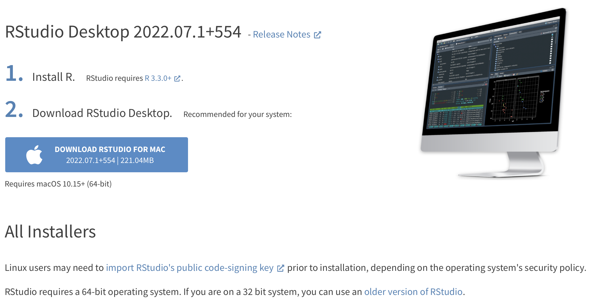
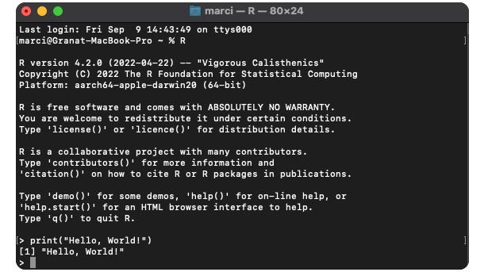
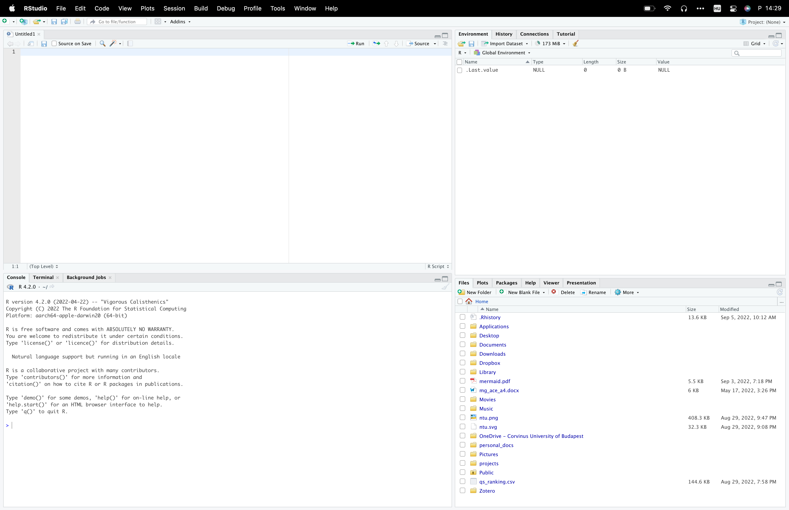
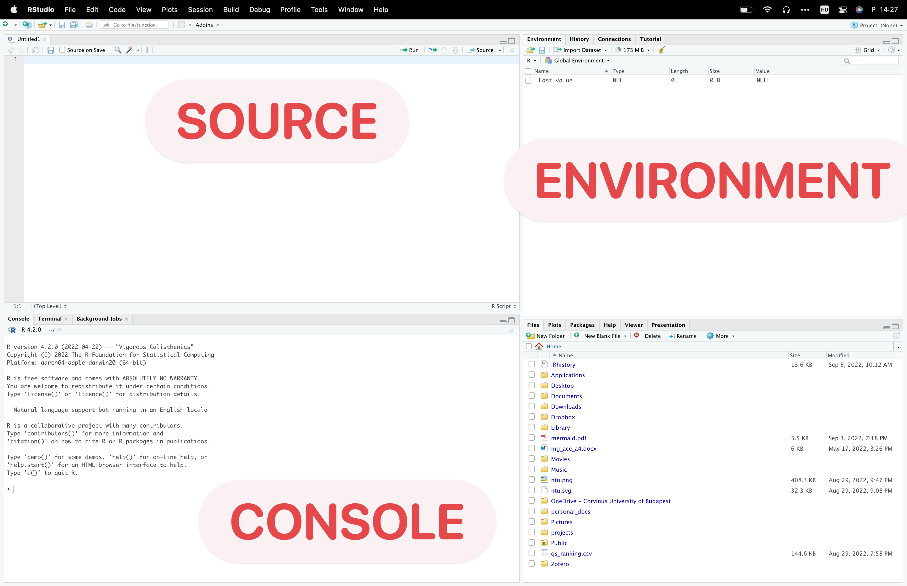
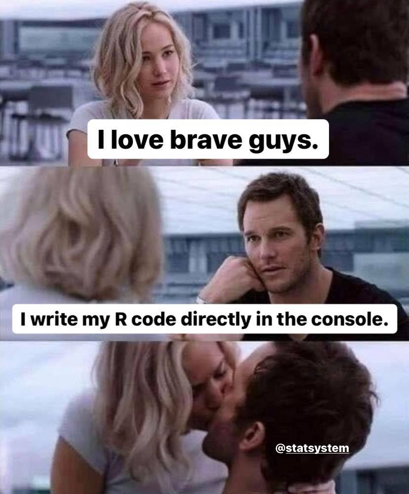
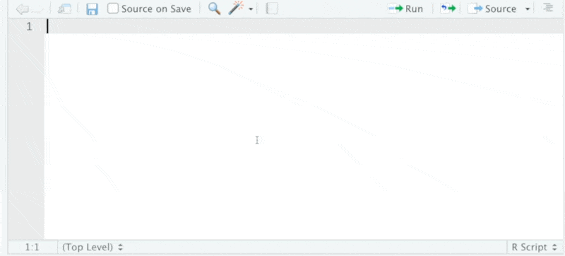
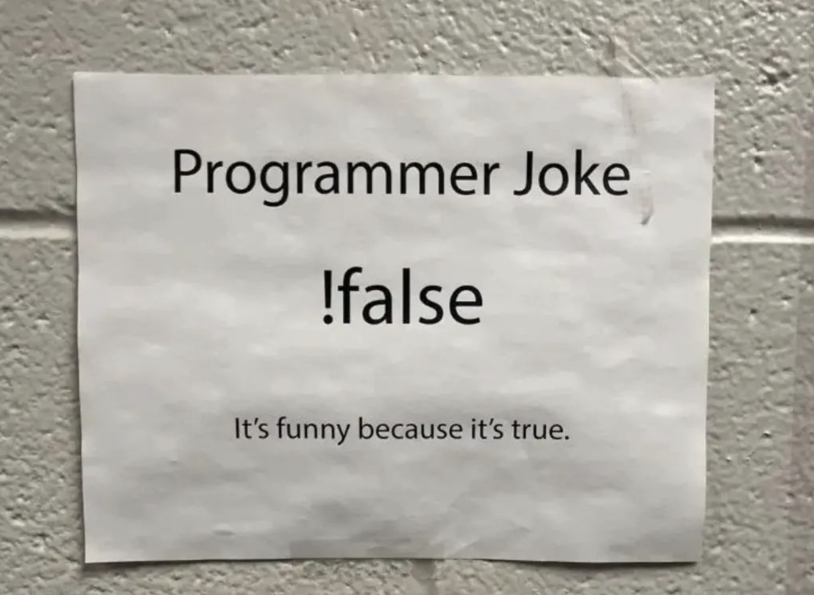

class: inverse, center, middle

# “The only way to write good code is to write tons of shitty code first. Feeling shame about bad code stops you from getting to good code” 

### Hadley Wickham

```{css, echo=FALSE}
.red { color: red; }
.blue { color: #378C95; }
strong { color: red; }
a { color: #378C95; font-weight: bold; }
.remark-inline-code { font-weight: 900; background-color: #a7d5e7; }
.caption { color: #378C95; font-style: italic; text-align: center; }

.content-box { 
box-sizing: content-box;
background-color: #378C95;
/* Total width: 160px + (2 * 20px) + (2 * 8px) = 216px
Total height: 80px + (2 * 20px) + (2 * 8px) = 136px
Content box width: 160px
Content box height: 80px */
}

.content-box-green {
background-color: #d9edc2;
}

.content-box-red {
background-color: #f9dbdb;
}

```


```{r xaringan-themer, include=FALSE, warning=FALSE}
library(xaringanthemer)
library(tidyverse)
library(knitr)
library(emo)

style_mono_accent(
  base_color = "#DC322F",               # bright red
  inverse_background_color = "#002B36", # dark dark blue
  inverse_header_color = "#378C95",     # light aqua green
  inverse_text_color = "#FFFFFF",       # white
  title_slide_background_color = "var(--base)",
  text_font_google = google_font("Kelly Slab"),
  header_font_google = google_font("Oleo Script")
)

xaringanExtra::use_panelset()
xaringanExtra::html_dependency_clipboard()
xaringanExtra::html_dependency_scribble(pen_color = "#378C95", 3, 4)
xaringanExtra::use_tile_view()
```

```{r setup, include=FALSE}
options(htmltools.dir.version = FALSE)
knitr::opts_chunk$set(echo = FALSE)
```


---
class: left

# Today's .blue[Agenda]

### Session 1 - Introduction to Statistics

1. Basic concepts of **statistical analysis** `r ji("hatching")`

2. Introduction and recommendations of **databases** for your future projects

3. Descriptive statistics `r ji("bar_chart")`

### Session 2 - Introduction to R

1. Why R? Setup `r ji("plug")`

2. Data types, basic manipulations `r ji("floppy")`

3. Conditional statements, loops `r ji("infinity")`

4. **Fun**ctions `r ji("hugging")` , apply

---

# Why R?

.pull-left[
R is a **free** software, used by millions in the field of statistics, data science, economics and many others.

The R programming language is an important tool for data related tasks, but it is much more.
Just like other programming languages, R has many additional **packages** (18,584 in the CRAN), which can extend its basic functionality.
R has far the best **graphical tools** to create your charts, and with **shiny**, you can easily build your minimalist web applications, or dashboards.

.blue[We will learn about data manipulation, analysis and visualization methods.]

]

.pull-right[
```{r echo = FALSE}

```
]

---

## Why R? - Some examples

[A COVID tracker **written in R** (shiny, leaflet)](https://vac-lshtm.shinyapps.io/ncov_tracker/?_ga=2.146567862.383333130.1662737117-60780019.1662551588)


```{r echo = FALSE, out.height="1200px"}
include_app("https://vac-lshtm.shinyapps.io/ncov_tracker/?_ga=2.146567862.383333130.1662737117-60780019.1662551588", height = "400px")
```

???

source: https://shiny.rstudio.com/gallery/covid19-tracker.html

---

## Why R? - Some examples

[Real-time epidemiology of the Hungarian coronavirus epidemic (Tamás Ferenci)](https://research.physcon.uni-obuda.hu/COVID19MagyarEpi/)

```{r echo = FALSE, out.height="1200px"}
include_app("https://research.physcon.uni-obuda.hu/COVID19MagyarEpi/", height = "400px")
```

---

## Why R? - Some examples

.blue[Data import & complex visualization in 10 minutes]

```{r}
include_graphics("introduction-to-r_files/demograph-behind.gif")
```


---

# Setup

You can download R and RStudio from the official site of [RStudio](https://www.rstudio.com/products/rstudio/download/#download).
Please install the appropriate version based on your OS, and do not forget that you also have to install R as well.

```{r}

```


---

# What is RStudio?

RStudio is dedicated IDE (Integrated Development Environment) for R. It is not necessary to have RStudio on your PC in order to run **R code**, and you can also create codes on `notepad`. After all, it's just a **text file**.

.pull-left[
```{r echo=FALSE, fig.cap="Using R on the terminal", out.height="200px", out.width="400px"}

```
]

.pull-right[
```{r echo=FALSE, out.width="250px"}

```
]


If you like it better, you can use anything else instead (VScode for example), but I personally don't recommend it. RStudio is developed specially for R (and Python recently), therefore it will help us more than other IDEs (e.g. code snippets, code completions, rendering).

---

# At first glance

```{r echo=FALSE}

```

---

# At first glance

```{r echo=FALSE} 

```

---

# At first glance

## Source

We will write here our codes, which we would like to save. The default extension of our codes are `.R`, but this is not the only possibility (we will cover this later). Once you save your code for later use, you can open your script also with a simple text editor (like `Notepad`), since this is only plain text. If you hit `enter` your code wont be executed, you will just simply start a new line. If you want to run your code hit `ctrl + enter` to execute a single line, and `ctrl+shift+enter` to execute your full script.


---

# At first glance


.pull-left[
## Console

Here you find the executed codes, and the response to that. For example, if you type `2 + 2` and hit `enter`, R will execute the expression, and response that it is 4.

```{r echo = TRUE}
2 + 2
```
]

.pull-right[
```{r out.height="400px"}

```

]


---

# At first glance

## Environment

Here you can see the list of the variables you have already created. For example you can type `x = 3` on the console. Now and x variable will appear in the environment pane, and you can check its value if you type `x` on the console. You can also save these variables into an `.RData` data format if you wish.

--

.content-box-green[
Hint: Go to preferences (General -> Advanced) and enable the "Show **.Last.value** in environment listing" option. 
]

---

# At first glance

## Help

.pull-left[
You can use this pane if you are not familier with a function. For example, you want to know what input you can specify while using `mean`, you can type `?mean` on the console, or use the search field on this pane. The description of the function will be presented on this pane. (This pane is super useful on the exam)
]

.pull-right[
```{r}

```

]

---
# At first glance

##  Files

You can see the list of your files which are in the current working directory. Working directory is the folder, from where R want currently read the files. If you want to import a dataset, just click on a file on this pane.

I highly recommend you to set a project folder for the class and any later job. This means that, R creates a folder and puts an `.Rproj` file into it. You can always click on this  `.Rproj` file to return your unfinished work. You can customise if R should put the variables into your environtent as you left them last time, you have a history about the used codes, and you see all the data you copy + paste into this folder.

---

## Packages

You can install packages from this pane. If you need a given package, click on install, and start typing its name. After that, you have to activate packages each time you open R again with the `library(eurostat)` command. You can also use a function from a package if you just simply type `eurostat::get_eurostat()`.


.content-box-green[
Hint: Never leave an install.packages(...) line in your code! This is the worst habit you can have in R programming, yet many people do it. If you think it's useful so that others can run it, it's not worth it either, since RStudio automatically detects packages that haven't been installed yet and recommends installing them.
]

---

class: middle, center, inverse

# Data types

---

## Data types

## Numeric

Lets see first, what kind of datatypes exist in R. Lets assign a variable called `x`.

```{r echo = TRUE}
x <- 4
```

So, what is the type of `x`? We can use the `class` command to answer this.

```{r echo = TRUE}
class(x)
```

Its numeric. This means that you can use `+`, `-`, `*` operators on it. (Integer and double also exist in R, but these are not the default, and variables will be always coerced automatically.)

---

## Character

```{r echo = TRUE}
y <- "blue"
class(y)
```

Its a character, basically can contain any kind of letter, digits, or white space.

## Logical

```{r echo = TRUE}
does_it_rain <- TRUE
class(does_it_rain)
```

Its a logical value. It can be `TRUE` or `FALSE`

---

# Vectors

We can create a vector with the `c` function. (combine)

```{r echo = TRUE}
x <- c(11, 201, 301)
x
```

We can asses a given element of it by:

```{r echo = TRUE}
x[2]
```

Or you can use functions on it:

.pull-left[
```{r echo = TRUE}
sum(x)
```
]

.pull-right[
```{r echo = TRUE}
x + 2
```
]

---

## Creating vectors (sequences)

You can also easily create sequence with the syntax `start:stop`

```{r echo = TRUE}
1:10
```

--

Or with the `seq` function

```{r echo = TRUE}
seq(from = 2, to = 10, by = 2)
```

```{r echo = TRUE}
seq(from = 3, to = 53, length.out = 11)
```

.pull-left[
```{r echo = TRUE}
x
```
]

.pull-right[
```{r echo = TRUE}
seq_along(x)
```
]


---

# Factors

If you combine characters, you can convert this vector to factor type. This is useful if you want to sort the possible values into a given order, or specify which values should be accepted and which should be omitted.

Lets see a minimal example:

```{r echo = TRUE}
my_vector <- c("XL", "M", "L", "S", "L", "other")
sort(my_vector)
```

```{r echo = TRUE}
my_vector2 <- factor(my_vector, 
                     ordered = TRUE, 
                     levels = c("XS", "S", "M", "L", "XL")
)

sort(my_vector2)
```

---

# Data Frame

You can merge the vectors into a `data.frame`, which is simple a **table**. Each column is a *variable* (with a header), and each row is an *observation*.

```{r}
avengers_df <- data.frame(
  id = 1:4,
  name = c("Captain America", "Hulk", "Groot","Strange"), 
  species = c("human", NA, "Flora colossus", "human")
)

avengers_df
```

`NA` stands for "not applicable", so these values are missing. Most of the times you will work with data.frame, so it is the most important type.

---

# List

Storing more complex data, you can use the `list`. To use `data.frame` you need vectors with equal length. If this does not hold, or a more frequent case, you want to store a collection of data.frames, then `list` is a perfect solution! It is not a rare issue*, big panel dataset are usually stored in separated files (a different file to each year, like: `cis_survey2016.csv`, `cis_survey2017.csv`). In this situations its suggested to store your data in a list.

```{r echo = TRUE}
mylist <- list(avengers_df, my_vector, x)
```

Now `mylist` stores a data.frame and two vectors. You can access the elements by `[[ ]]`. For example, the 2nd element:

```{r echo = TRUE}
mylist[[2]]
```

.footnote[\*: *In the case of multiple models, we will also store them in a list, but more on that later*]

---

# Import data into R

The easiest way to import your data is to click on it in the files pane. This simple solution works if you have to import and analyse the data once, but probably you want to use your data next time as well. That is way it is a good idea to copy and paste the code for importing the data into your script (delete the `View()` command after that).

```{r echo = F, out.height="400px"}
knitr::include_graphics("introduction-to-r_files/importcsv.gif")
```

---

## Path to your files

If the data is in your working directory, you can refer to it with "**relative referencing**". This means that you have to type only the name of the file, not the full path, because R will automatically start to look for the file in the working directory.

--

.content-box-green[
That is the reason why you should always set a `project`* to your work.
]

.footnote[\* *A git `r fontawesome::fa("github")` repo is more recommended, but it is not part of the current course.*]

--

.content-box-green[
HINT: You can type `""` anywhere in the source/console pane and hit `TAB` to completions to the files.
]

--

.content-box-green[
HINT: `list.files()` returns the name and path of the files in your current working directory.
]


#### Online data?

If the file you want to import was previously downloaded from a website, you can simply refer to the download **link** and **read it into R directly**. For this you have to only modify the path of the file to the download link what is available at the `download` folder in your browser.

---

# Conditional statements

We offen use conditional statement in programming. It has a clean concept: *If the condition is TRUE, then evaluate the following task.*


<p align="center"><iframe width="711" height="400" src="https://www.youtube.com/embed/m2Ux2PnJe6E" title="YouTube video player" frameborder="0" allow="accelerometer; autoplay; clipboard-write; encrypted-media; gyroscope; picture-in-picture" allowfullscreen></iframe></p>

---

# Snippets

.content-box-green[
If you want to write an if else statement in R, I highly recommend you to use a **snippet** for that. Snippet means, that when you type `if` and press `shift + tab`, then R will automatically write the framework you have to use:
]

```{r}

```

---

# Logical Operators in R

.pull-left[

```{r echo=TRUE}
4 < 5
5 <= 5
4 > 5
```
]

.pull-right[

```{r echo=TRUE}
5 >=4
2 == 3 # equal?
3 != 3 # not equal?
```
]

```{r out.height="200px", out.width="300px", fig.align='center'}

```


???

source: https://www.instagram.com/p/CiEXTeRodhj/

---

# Logical Operators in R

.pull-left[

```{r echo=TRUE}
4 < 5
5 <= 5
4 > 5
```
]

.pull-right[

```{r echo=TRUE}
5 >=4
2 == 3 # equal?
3 != 3 # not equal?
```
]

```{r echo=TRUE}
(2 + 2) == 4
is.na(4)
is.na(NA)
3 %in% c(1, 2, 3)
stringr::str_detect(string = "this function is awesome!", pattern = "some")
stringr::str_detect(string = "this function is awesome!", pattern = "none")
```

You can also specify the task R has to do, if the statement is false.

```{r}
if (2>3) {
  print("Print this")
} else {
  print("Print that")
}
```

## Loops

### While

You can also use while loop to specify a task R has to do until a condition is TRUE.

```{r}
x <- 1

while (x < 15) {
  cat(paste0(x, "^2=")) # cat = print, just into the same line
  cat(x^2)
  cat("\n") # force R to create a new line
  x <- x + 1 # if you miss this step then R will repeat the task infinit times
}
```

### For

With this framewrok you can specify a task, that R has to do x times. For example, print a message 10 times.

```{r}
for (i in 1:10) {
  print("You R amazing!")
}
```

And you can use `i` inside the `{` parenthesis.

```{r}
for (i in 1:5) {
  print(i)
}
```

## Functions

We offen work with functions in R, but you can also write your own. You have to use the `function` word and specify the input variables.

```{r}
my_first_function <- function(x) {
  # removed all non-digit characters from x, and take the squared of it.
  as.numeric(gsub(x, pattern = "\\D", replacement = ""))^2
}

my_first_function("Depends on, maybe 5 slices")
```

## Apply family

This family contains 3 functions, which I want to show you (There are more complex ones, those are not covered in this bookdown). 

The function `apply` tells R to use a function on each row or column of a data.frame. So the its frist argument is the `data.frame`, the third is the function which shoul use and the second is the margin:
- margin = 2: apply the given function on each of the COLUMNS
- margin = 1: apply the given function on each of the ROWS

```{r}
non_na <- function(x) {
  # how many numeric observation are in the vector
  sum(!is.na(as.numeric(x)))
}
```

Number of numeric answers by quetions:

```{r}
# apply(df, 2, non_na)
```

Number of numeric answers by participant:

```{r}
# apply(df, 1, non_na)
```

`Lapply` is similar but with list objects. 

```{r}
mylist <- list(
  first_vector = c(1, 2, 3),
  second_vector = letters # built in character vector, contains all the letters
)

mylist
```

We are interested in the number of observation (the `length`) of each vector:

```{r}
out <- lapply(mylist, length)

out

class(out)
```

But the output is still a list. `sapply` is the solution if we want to convert it into vector.

```{r}
sapply(mylist, length)
```

