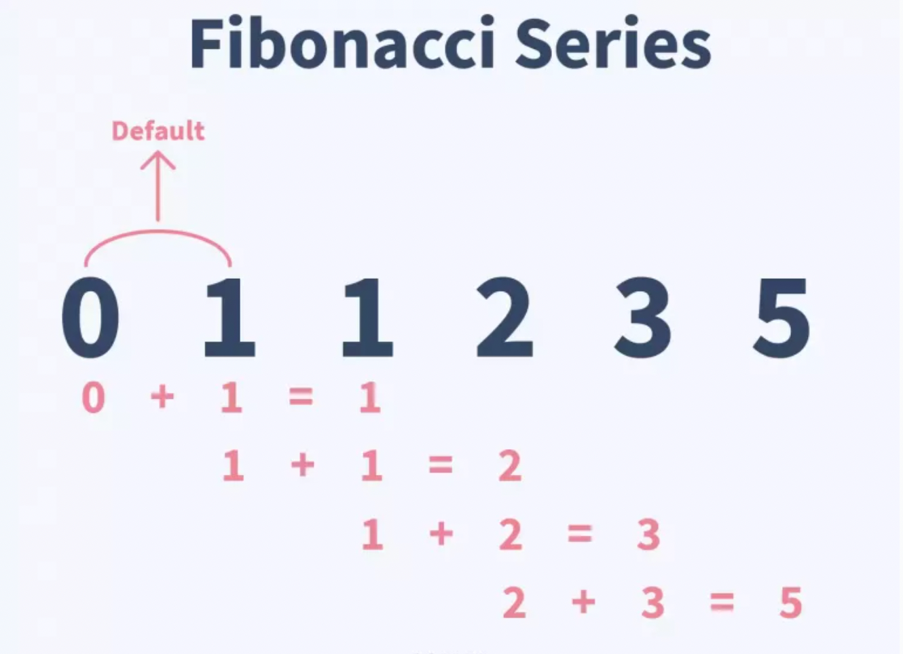

class: inverse, center, middle

# “The only way to write good code is to write tons of shitty code first. Feeling shame about bad code stops you from getting to good code” 

### Hadley Wickham

```{css, echo=FALSE}
.red { color: red; }
.blue { color: #378C95; }
strong { color: red; }
a { color: #378C95; font-weight: bold; }
.remark-inline-code { font-weight: 900; background-color: #a7d5e7; }
.caption { color: #378C95; font-style: italic; text-align: center; }

.content-box { 
box-sizing: content-box;
background-color: #378C95;
/* Total width: 160px + (2 * 20px) + (2 * 8px) = 216px
Total height: 80px + (2 * 20px) + (2 * 8px) = 136px
Content box width: 160px
Content box height: 80px */
}

.content-box-green {
background-color: #d9edc2;
}

.content-box-red {
background-color: #f9dbdb;
}

```


```{r xaringan-themer, include=FALSE, warning=FALSE}
library(xaringanthemer)
library(tidyverse)
library(knitr)
library(emo)

style_mono_accent(
  base_color = "#DC322F",               # bright red
  inverse_background_color = "#002B36", # dark dark blue
  inverse_header_color = "#378C95",     # light aqua green
  inverse_text_color = "#FFFFFF",       # white
  title_slide_background_color = "var(--base)",
  text_font_google = google_font("Kelly Slab"),
  header_font_google = google_font("Oleo Script")
)

xaringanExtra::use_panelset()
xaringanExtra::html_dependency_clipboard()
xaringanExtra::html_dependency_scribble(pen_color = "#378C95", 3, 4)
xaringanExtra::use_tile_view()
```

```{r setup, include=FALSE}
options(htmltools.dir.version = FALSE)
knitr::opts_chunk$set(echo = FALSE)
```


---
class: left

# Today's .blue[Agenda]

### Session 1 - Introduction to Statistics

1. Basic concepts of **statistical analysis** `r ji("hatching")`

2. Introduction and recommendations of **databases** for your future projects

3. Descriptive statistics `r ji("bar_chart")`

### Session 2 - Introduction to R

1. Why R? Setup `r ji("plug")`

2. Data types, basic manipulations `r ji("floppy")`

3. Conditional statements, loops `r ji("infinity")`

4. **Fun**ctions `r ji("hugging")` , apply

---

# Why R?

.pull-left[
R is a **free** software, used by millions in the field of statistics, data science, economics and many others.

The R programming language is an important tool for data related tasks, but it is much more.
Just like other programming languages, R has many additional **packages** (18,584 in the CRAN), which can extend its basic functionality.
R has far the best **graphical tools** to create your charts, and with **shiny**, you can easily build your minimalist web applications, or dashboards.

.blue[We will learn about data manipulation, analysis and visualization methods.]

]

.pull-right[
```{r echo = FALSE}
include_graphics("introduction-to-r_files/meme_free.jpg")
```
]

---

## Why R? - Some examples

[A COVID tracker **written in R** (shiny, leaflet)](https://vac-lshtm.shinyapps.io/ncov_tracker/?_ga=2.146567862.383333130.1662737117-60780019.1662551588)


```{r echo = FALSE, out.height="1200px"}
include_app("https://vac-lshtm.shinyapps.io/ncov_tracker/?_ga=2.146567862.383333130.1662737117-60780019.1662551588", height = "400px")
```

???

source: https://shiny.rstudio.com/gallery/covid19-tracker.html

---

## Why R? - Some examples

[Real-time epidemiology of the Hungarian coronavirus epidemic (Tamás Ferenci)](https://research.physcon.uni-obuda.hu/COVID19MagyarEpi/)

```{r echo = FALSE, out.height="1200px"}
include_app("https://research.physcon.uni-obuda.hu/COVID19MagyarEpi/", height = "400px")
```

---

## Why R? - Some examples

.blue[Data import & complex visualization in 10 minutes]

```{r}
include_graphics("introduction-to-r_files/demograph-behind.gif")
```


---

# Setup

You can download R and RStudio from the official site of [RStudio](https://www.rstudio.com/products/rstudio/download/#download).
Please install the appropriate version based on your OS, and do not forget that you also have to install R as well.

```{r}

```


---

# What is RStudio?

RStudio is dedicated IDE (Integrated Development Environment) for R. It is not necessary to have RStudio on your PC in order to run **R code**, and you can also create codes on `notepad`. After all, it's just a **text file**.

.pull-left[
```{r echo=FALSE, fig.cap="Using R on the terminal", out.height="200px", out.width="400px"}

```
]

.pull-right[
```{r echo=FALSE, out.width="250px"}

```
]


If you like it better, you can use anything else instead (VScode for example), but I personally don't recommend it. RStudio is developed specially for R (and Python recently), therefore it will help us more than other IDEs (e.g. code snippets, code completions, rendering).

---

# At first glance

```{r echo=FALSE}

```

---

# At first glance

```{r echo=FALSE} 

```

---

# At first glance

## Source

We will write here our codes, which we would like to save. The default extension of our codes are `.R`, but this is not the only possibility (we will cover this later). Once you save your code for later use, you can open your script also with a simple text editor (like `Notepad`), since this is only plain text. If you hit `enter` your code wont be executed, you will just simply start a new line. If you want to run your code hit `ctrl + enter` to execute a single line, and `ctrl+shift+enter` to execute your full script.


---

# At first glance


.pull-left[
## Console

Here you find the executed codes, and the response to that. For example, if you type `2 + 2` and hit `enter`, R will execute the expression, and response that it is 4.

```{r echo = TRUE}
2 + 2
```
]

.pull-right[
```{r out.height="400px"}
include_graphics("introduction-to-r_files/meme-brave.jpg")
```

]


---

# At first glance

## Environment

Here you can see the list of the variables you have already created. For example you can type `x = 3` on the console. Now and x variable will appear in the environment pane, and you can check its value if you type `x` on the console. You can also save these variables into an `.RData` data format if you wish.

--

.content-box-green[
Hint: Go to preferences (General -> Advanced) and enable the "Show **.Last.value** in environment listing" option. 
]

---

# At first glance

## Help

.pull-left[
You can use this pane if you are not familier with a function. For example, you want to know what input you can specify while using `mean`, you can type `?mean` on the console, or use the search field on this pane. The description of the function will be presented on this pane. (This pane is super useful on the exam)
]

.pull-right[
```{r}
include_graphics("introduction-to-r_files/meme-help.jpg")
```

]

---
# At first glance

##  Files

You can see the list of your files which are in the current working directory. Working directory is the folder, from where R want currently read the files. If you want to import a dataset, just click on a file on this pane.

I highly recommend you to set a project folder for the class and any later job. This means that, R creates a folder and puts an `.Rproj` file into it. You can always click on this  `.Rproj` file to return your unfinished work. You can customise if R should put the variables into your environtent as you left them last time, you have a history about the used codes, and you see all the data you copy + paste into this folder.

---

# At first glance

## Packages

You can install packages from this pane. If you need a given package, click on install, and start typing its name. After that, you have to activate packages each time you open R again with the `library(eurostat)` command. You can also use a function from a package if you just simply type `eurostat::get_eurostat()`.


.content-box-green[
Hint: Never leave an install.packages(...) line in your code! This is the worst habit you can have in R programming, yet many people do it. If you think it's useful so that others can run it, it's not worth it either, since RStudio automatically detects packages that haven't been installed yet and recommends installing them.
]

---

class: middle, center, inverse

# Data types

---

## Data types

## Numeric

Lets see first, what kind of datatypes exist in R. Lets assign a variable called `x`.

```{r echo = TRUE}
x <- 4
```

So, what is the type of `x`? We can use the `class` command to answer this.

```{r echo = TRUE}
class(x)
```

Its numeric. This means that you can use `+`, `-`, `*` operators on it. (Integer and double also exist in R, but these are not the default, and variables will be always coerced automatically.)

---

## Character

```{r echo = TRUE}
y <- "blue"
class(y)
```

Its a character, basically can contain any kind of letter, digits, or white space.

## Logical

```{r echo = TRUE}
does_it_rain <- TRUE
class(does_it_rain)
```

Its a logical value. It can be `TRUE` or `FALSE`

---

# Vectors

We can create a vector with the `c` function. (combine)

```{r echo = TRUE}
x <- c(11, 201, 301)
x
```

We can asses a given element of it by:

```{r echo = TRUE}
x[2]
```

Or you can use functions on it:

.pull-left[
```{r echo = TRUE}
sum(x)
```
]

.pull-right[
```{r echo = TRUE}
x + 2
```
]

---

## Creating vectors (sequences)

You can also easily create sequence with the syntax `start:stop`

```{r echo = TRUE}
1:10
```

--

Or with the `seq` function

```{r echo = TRUE}
seq(from = 2, to = 10, by = 2)
```

```{r echo = TRUE}
seq(from = 3, to = 53, length.out = 11)
```

.pull-left[
```{r echo = TRUE}
x
```
]

.pull-right[
```{r echo = TRUE}
seq_along(x)
```
]


---

# Factors

If you combine characters, you can convert this vector to factor type. This is useful if you want to sort the possible values into a given order, or specify which values should be accepted and which should be omitted.

Lets see a minimal example:

```{r echo = TRUE}
my_vector <- c("XL", "M", "L", "S", "L", "other")
sort(my_vector)
```

```{r echo = TRUE}
my_vector2 <- factor(my_vector, 
                     ordered = TRUE, 
                     levels = c("XS", "S", "M", "L", "XL")
)

sort(my_vector2)
```

---

# Data Frame

You can merge the vectors into a `data.frame`, which is simple a **table**. Each column is a *variable* (with a header), and each row is an *observation*.

```{r}
avengers_df <- data.frame(
  id = 1:4,
  name = c("Captain America", "Hulk", "Groot","Strange"), 
  species = c("human", NA, "Flora colossus", "human")
)

avengers_df
```

`NA` stands for "not applicable", so these values are missing. Most of the times you will work with data.frame, so it is the most important type.

---

# List

Storing more complex data, you can use the `list`. To use `data.frame` you need vectors with equal length. If this does not hold, or a more frequent case, you want to store a collection of data.frames, then `list` is a perfect solution! It is not a rare issue*, big panel dataset are usually stored in separated files (a different file to each year, like: `cis_survey2016.csv`, `cis_survey2017.csv`). In this situations its suggested to store your data in a list.

```{r echo = TRUE}
mylist <- list(avengers_df, my_vector, x)
```

Now `mylist` stores a data.frame and two vectors. You can access the elements by `[[ ]]`. For example, the 2nd element:

```{r echo = TRUE}
mylist[[2]]
```

.footnote[\*: *In the case of multiple models, we will also store them in a list, but more on that later*]

---

# Import data into R

The easiest way to import your data is to click on it in the files pane. This simple solution works if you have to import and analyse the data once, but probably you want to use your data next time as well. That is way it is a good idea to copy and paste the code for importing the data into your script (delete the `View()` command after that).

```{r echo = F, out.height="400px"}
knitr::include_graphics("introduction-to-r_files/importcsv.gif")
```

---

## Path to your files

If the data is in your working directory, you can refer to it with "**relative referencing**". This means that you have to type only the name of the file, not the full path, because R will automatically start to look for the file in the working directory.

--

.content-box-green[
That is the reason why you should always set a `project`* to your work.
]

.footnote[\* *A git `r fontawesome::fa("github")` repo is more recommended, but it is not part of the current course.*]

--

.content-box-green[
HINT: You can type `""` anywhere in the source/console pane and hit `TAB` to completions to the files.
]

--

.content-box-green[
HINT: `list.files()` returns the name and path of the files in your current working directory.
]


#### Online data?

If the file you want to import was previously downloaded from a website, you can simply refer to the download **link** and **read it into R directly**. For this you have to only modify the path of the file to the download link what is available at the `download` folder in your browser.

---

# Conditional statements

We offen use conditional statement in programming. It has a clean concept: *If the condition is TRUE, then evaluate the following task.*


<p align="center"><iframe width="711" height="400" src="https://www.youtube.com/embed/m2Ux2PnJe6E" title="YouTube video player" frameborder="0" allow="accelerometer; autoplay; clipboard-write; encrypted-media; gyroscope; picture-in-picture" allowfullscreen></iframe></p>

---

# Snippets

.content-box-green[
If you want to write an if else statement in R, I highly recommend you to use a **snippet** for that. Snippet means, that when you type `if` and press `shift + tab`, then R will automatically write the framework you have to use:
]

```{r}

```

---

# Logical Operators in R

.pull-left[

```{r echo=TRUE}
4 < 5
5 <= 5
4 > 5
```
]

.pull-right[

```{r echo=TRUE}
5 >=4
2 == 3 # equal?
3 != 3 # not equal?
```
]

```{r out.height="200px", out.width="300px", fig.align='center'}
knitr::include_graphics("introduction-to-r_files/meme_false.png")
```


???

source: https://www.instagram.com/p/CiEXTeRodhj/

---

# Logical Operators in R

.pull-left[

```{r echo=TRUE}
4 < 5
5 <= 5
4 > 5
```

```{r echo=TRUE}
(2 + 2) == 4
is.na(4)
```
]

.pull-right[

```{r echo=TRUE}
5 >=4
2 == 3 # equal?
3 != 3 # not equal?
```

```{r echo=TRUE}
is.na(NA)
3 %in% c(1, 2, 3)
```
]

---

#### Division

.pull-left[
```{r echo=TRUE}
13 %% 5 # remainder
```
]

.pull-right[
```{r echo=TRUE}
13 %/% 5
```
]

#### Combining conditions

.pull-left[
```{r echo=TRUE}
2 == 2 & 2 == 3 # and
```
]

.pull-right[
```{r echo=TRUE}
2 == 2 | 2 == 3 # or
```
]

#### Working with vectors

```{r echo = TRUE}
x <- 1:10
x %% 3 == 0
which(x %% 3 == 0)
```

---


### IF

```{r eval = FALSE, echo = TRUE}
if ((exam_p + assignment_p) >= 90 & assignment_p >= 30) {
  grade <- 5
} else if ((exam_p + assignment_p) >= 80 & assignment_p >= 30) {
  grade <- 4
} else if ((exam_p + assignment_p) >= 66 & assignment_p >= 30) {
  grade <- 3
} else if ((exam_p + assignment_p) >= 50 & assignment_p >= 30) {
  grade <- 2
} else { # if none are TRUE
  grade <- 1
}
```

--

*Of course, there are simpler solutions to handle so many possible outputs, but this is just an illustrative example.*

---

class: center, middle, inverse

# Loops `r ji("infinity")`

---

# For loop

With this framework you can specify a task, that R has to do x times. For example, print a message 10 times.

```{r echo = TRUE}
for (i in 1:10) {
  print("You R amazing!")
}
```

---

.pull-left[


And you can use `i` inside the `{` parenthesis.

```{r echo = TRUE}
for (i in 1:5) {
  print(i)
}
```
]

--

.pull-right[
.content-box-green[
HINT: You have to learn how to use the for loop, because you will definitely face with it in other programming languages and in specific cases. However, we will see later that it is definitely worth avoiding their use in R, because **easier to read and faster codes can be written in other ways**. But it is worth using them, when you need to refer to the result of the **previous evaluation**.
]
]


```{r out.height="300px", out.width="358px", fig.align='center'}

```

???

source of photo: https://www.reddit.com/r/memes/comments/conmyc/why_is_fibonacci/

---

### Fibonacci with for loop - first 10 elements

.pull-left[
```{r out.height="200px", out.width="250px"}

```
]

.pull-right[
`head(x, n)`: first n elements of x
`tail(x, n)`: last n elements of x
]

```{r echo= TRUE}
fibonacci_seq <- c(0, 1) # initial = 2 elements

for (i in 1:8) { # 8 + 2 = 10
  new_elem <- sum(tail(fibonacci_seq, 2))
  
  fibonacci_seq <- c(fibonacci_seq, new_elem)
}

fibonacci_seq
```

---

# While

You can also use `while` loop to specify a task R has to do until a condition is TRUE.

```{r echo = TRUE}
x <- 1

while (x < 7) {
  cat(paste0(x, "^2=")) # cat = print, just into the same line
  cat(x^2)
  cat("\n") # force R to create a new line
  x <- x + 1 # what happens if you miss this?
}


```

---

### Fibonacci with while loop - until reaches a limit (25)

```{r echo= TRUE}
fibonacci_seq <- c(0, 1) # initial = 2 elements
new_elem <- tail(fibonacci_seq, 1)

while (new_elem <  25) {
  new_elem <- sum(tail(fibonacci_seq, 2))
  if (new_elem < 25) { # do not add the one higher
    fibonacci_seq <- c(fibonacci_seq, new_elem)
  }
}

fibonacci_seq
```

---
class: center, middle, inverse

# Functions

####"You should consider writing a function whenever you’ve copied and pasted a block of code more than twice [...]"

Hadley Wickham


???

Source: https://r4ds.hadley.nz/functions.html

---

# Functions

We often work with functions in R, and you can also write your own. You have to use the `function` word and specify the input variables.

.content-box-green[
HINT: Use the FUN `r ji("hugging")` snippet for that.
]

```{r echo=TRUE}
fibonacci <- function(n) {
  fibonacci_seq <- c(0, 1) # initial = 2 elements
  
  for (i in 1:(max(n) - 2)) { # n can be a vector
    new_elem <- sum(tail(fibonacci_seq, 2))
    
    fibonacci_seq <- c(fibonacci_seq, new_elem)
  }
  
  fibonacci_seq[n]
}
```

.pull-left[
```{r echo = TRUE}
fibonacci(1:5)
```
]

.pull-right[
```{r echo = TRUE}
fibonacci(5)
```
]

---

## Funcions - default inputs

```{r echo=TRUE}
fibonacci <- function(n = 1:6) {
  fibonacci_seq <- c(0, 1) # initial = 2 elements
  
  for (i in 1:(max(n) - 2)) { # n can be a vector
    new_elem <- sum(tail(fibonacci_seq, 2))
    
    fibonacci_seq <- c(fibonacci_seq, new_elem)
  }
  
  fibonacci_seq[n]
}
```

.pull-left[
```{r echo = TRUE}
fibonacci()
```
]

.pull-right[
```{r echo = TRUE}
fibonacci(5)
```
]

---

class: center, middle, inverse

# Apply, Lapply, Sapply

---

# Apply

The function `apply` calls a function on each row or column of a data.frame (or matrix). So its first argument is the `data.frame`, the third is the function which should use and the second is the margin:
- margin = 2: apply the given function on each of the COLUMNS
- margin = 1: apply the given function on each of the ROWS

---

## Example - Fertility rates by country / by year

.blue[Replacement Fertility Rate]: Assuming there are no migration flows and that mortality rates remain unchanged, a total fertility rate of 2.1 children per woman generates broad stability of population.

--

```{r echo=TRUE}
above_replacement_prop <- function(x) {
  # proportion of observation above the replacement rate
  # exclude NAs
  sum(x >= 2.1, na.rm = TRUE) / sum(!is.na(x))
}
```

--

```{r echo = TRUE}
x <- c(1.3, 4, 2, NA)
above_replacement_prop(x)
```

---

## Example - Fertility rates by country / by year

### Data from OECD

```{r echo=TRUE, results='hide', message =FALSE}
fertility_df <- read_csv("https://stats.oecd.org/sdmx-json/data/DP_LIVE/.FERTILITY.../OECD?contentType=csv&detail=code&separator=comma&csv-lang=en")
fertility_df <- fertility_df[, c("LOCATION", "TIME", "Value")]  

fertility_df
```

```{r}
fertility_df %>% 
  head() %>% 
  mutate_all(
    ~ c(head(., -1), "...")
  ) %>% 
  granatlib::kable_output()
```

---

# Data manipulation

(This step is necessary, later we will understand what is actually happening here.)

```{r echo=TRUE, results='hide'}
fertility_df <- tidyr::pivot_wider(fertility_df, names_from = "LOCATION", 
                   values_from = "Value")

fertility_df <- tibble::column_to_rownames(fertility_df, "TIME")
fertility_df <- fertility_df[, - 51] # OECD average

fertility_df
```
  
```{r}
fertility_df %>% 
  head(4) %>% 
  mutate_all(
    ~ c(head(., -1), "...")
  ) %>% 
  select(1:4) %>% 
  mutate(`...` = "...") %>% 
  granatlib::kable_output()
```

At the end of these steps, we have a table, each column of which shows the time series of the fertility rate of a country.

---

### Apply - MARGIN = 1

```{r echo=TRUE}
apply(fertility_df, MARGIN = 1, above_replacement_prop)
```

If MARGIN == 1, the apply calculates the proportion of observation above 2.1 in each **row**. The returned value is a named vector, which means that you can refer to its values by index, or by name.

---

### Apply - MARGIN = 1

```{r echo=TRUE}
apply(fertility_df, MARGIN = 1, above_replacement_prop)[1]
apply(fertility_df, MARGIN = 1, above_replacement_prop)["2020"]
```

---

### Apply - MARGIN = 2

```{r echo=TRUE}
apply(fertility_df, MARGIN = 2, above_replacement_prop)
```

If MARGIN == 2, the apply calculates the proportion of observation above 2.1 in each **column**.

---

# Lapply

`lapply` should be used for same purposes, but it can be used for lists or vectors. 

```{r echo=TRUE}
mylist
```

---

# Lapply

`lapply` should be used for same purposes, but it can be used for lists or vectors. 

Length of each element:

```{r echo=TRUE}
lapply(mylist, length)
```

---

# Sapply

`sapply` is fully identical, but returns a vector (*s* stand for SIMPLIFY)

```{r echo=TRUE}
sapply(mylist, length)
```

---

class: center, middle

# Thank you for your attention!

Slides are available at [https://www.marcellgranat.com](https://www.marcellgranat.com)

