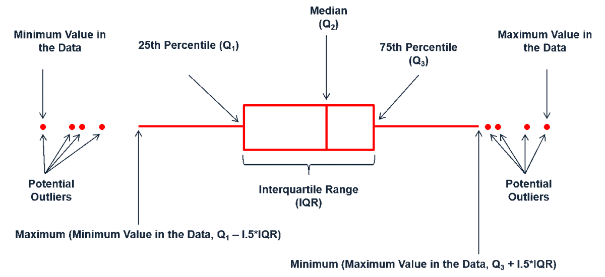

class: inverse, center, middle

# “Statistics is the grammar of Science” 

### Karl Pearson

```{css, echo=FALSE}
.red { color: red; }
.blue { color: #378C95; }
strong { color: red; }
a { color: #378C95; font-weight: bold; }
.remark-inline-code { font-weight: 900; background-color: #a7d5e7; }
.caption { color: #378C95; font-style: italic; text-align: center; }

.content-box { 
box-sizing: content-box;
background-color: #378C95;
/* Total width: 160px + (2 * 20px) + (2 * 8px) = 216px
Total height: 80px + (2 * 20px) + (2 * 8px) = 136px
Content box width: 160px
Content box height: 80px */
}

.content-box-green {
background-color: #d9edc2;
}

.content-box-red {
background-color: #f9dbdb;
}

```

```{r xaringan-themer, include=FALSE, warning=FALSE}
library(xaringanthemer)
library(tidyverse)
library(knitr)
library(granatlib)
library(emo)
style_mono_accent(
  base_color = "#DC322F",               # bright red
  inverse_background_color = "#002B36", # dark dark blue
  inverse_header_color = "#378C95",     # light aqua green
  inverse_text_color = "#FFFFFF",       # white
  title_slide_background_color = "var(--base)",
  text_font_google = google_font("Kelly Slab"),
  header_font_google = google_font("Oleo Script")
)

xaringanExtra::use_panelset()
xaringanExtra::html_dependency_clipboard()
xaringanExtra::html_dependency_scribble(pen_color = "#378C95", 3, 4)
xaringanExtra::use_tile_view()
```

```{r setup, include=FALSE}
options(htmltools.dir.version = FALSE)
knitr::opts_chunk$set(echo = FALSE, fig.align = "center")
```


---
class: left

# Today's .blue[Agenda]

### Session 1 - Introduction to Statistics

1. Basic concepts of **statistical analysis** `r ji("hatching")`

2. Descriptive statistics `r ji("bar_chart")`

### Session 2 - Introduction to R

1. Why R? Setup `r ji("plug")`

2. Data types, basic manipulations `r ji("floppy")`

3. Conditional statements, loops `r ji("infinity")`

4. **Fun**ctions `r ji("hugging")` , apply

---

# Aim of statistical analysis

--

> As we will see, the entire statistical methodology runs through an information-compressing approach.

--

1. Predictive tasks

2. Descriptive tasks

--

- Exploratory

- Confirmatory

---

class: middle, center, inverse

# The type of data

---

# Classification based on the structure

1. Unstructured

2. Structured

--

- The data are stored in a tabular format.

- Cross-sectional / Time-series / Longitudinal / Spatial / Network

--

```{r out.height="250px", out.width="530px"}
include_graphics("introduction-to-statistics_files/attributes_observations.png")
```


**Type of data determines which tools and techniques can be used to analyze the data!**

--

```{r}
attribute_types <- tibble::tribble(
     ~`Attribute type`,                                                                                                                                                      ~Description,                                                                                   ~Examples,                                                       ~Operations,
           "Nominal", "Nominal values provide only enough information to distinguish one object from another. (=, ≠)",                                         "Zip codes, employee ID numbers, eye color, gender",                 "Mode, entropy, contingency correlation, $\\chi^2$ test",
           "Ordinal",                                                                                 "The values of an ordinal attribute provide enough information to order objects. (<, >)",                        "Hardness of minerals, {good, better, best}, grades, street numbers",    "Quantiles, rank correlation",
          "Interval",                                                     "Differences between values are meaningful, i.e., a unit of measurement exists. (+, -)",                                      "Calendar dates, temperature in Celsius or Fahrenheit",  "mean, standard deviation, Pearson's correlation",
             "Ratio",                                                                                                "For ratio variables, both differences and ratios are meaningful. (*, /)", "Temperature in Kelvin, monetary quantities, counts, age, mass, length, electrical current",                "Geometric mean, harmonic mean, percent variation"
     )
```


```{r results='asis'}
for (i in 1:4) {
  cat("---")
  cat("\n")
  attribute_types %>% 
    head(i) %>% 
    kable(escape = FALSE, format = "html") %>% 
    cat()
  cat("\n")
}
```


???

ref: Introduction to Data Mining


---

class: inverse, middle, center

# Quality of data

---

background-image: url("introduction-to-statistics_files/meme_clean_data.jpg")

???

source: Statsystem

---

# The quality of data

Data is often far from perfect.

Frequently arising issues:

--

- missing data

--


- outliers

--

- duplication

--

- inconsistent data

---

## An illustrative story of data-related issues

.blue[Statistician:] So, you got the data for all the patients?

.blue[Data Miner:] Yes. I haven't had much time for analysis, but I do have a few interesting results.

.blue[Statistician:] Amazing. There were so many data issues with this set of patients that I couldn't do much.

.blue[Data Miner:] Oh? I didn't hear about any possible problems. 

.blue[Statistician:] Well, first there is field 5, the variable we want to predict. It's common knowledge among people who analyze this type of data that results are better if you work with the log of the values, but I didn't discover this until later. Was it mentioned to you?

.blue[Data Miner:] No.

.footnote[*Introduction to Data Mining, page 21-22*]

---

## An illustrative story of data-related issues

.blue[Statistician:] But surely you heard about what happened to field 4? It's supposed to be measured on a scale from 1 to 10, with 0 indicating a missing value, but because of a data entry error, all 10's were changed into 0's. Unfortunately, since some of the patients have missing values for this field, it's impossible to say whether a 0 in this field is a real 0 or a 10. Quite a few of the records have that problem.

.blue[Data Miner:] Interesting. Were there any other problems? .blue[Statistician:] Yes, fields 2 and 3 are basically the same, but I assume that you probably noticed that.

.blue[Data Miner:] Yes, but these fields were only weak predictors of field 5.

.blue[Statistician:] Anyway, given all those problems, I'm surprised you were able to accomplish anything.

.blue[Data Miner:] True, but my results are really quite good. Field 1 is a very strong predictor of field 5. I'm surprised that this wasn't noticed before.

.footnote[*Introduction to Data Mining, page 21-22*]

---

## An illustrative story of data-related issues

.blue[Statistician:] What? Field 1 is just an identification number. 

.blue[Data Miner:] Nonetheless, my results speak for themselves.


.blue[Data Miner:] Nonetheless, my results speak for themselves. 

.blue[Statistician:] Oh, no! I just remembered. We assigned ID numbers after we sorted the records based on field 5. There is a strong connection, but it's meaningless. Sorry.

.footnote[*Introduction to Data Mining, page 21-22*]


---

class: inverse, center, middle

# Central Tendency

## Descriptive statistics

---

# Different mean calculations

#### 1. Arithmetic mean

$$\bar{Y}=\frac{Y_1+Y_2+\ldots+Y_N}{N}=\frac{\sum_{i=1}^N Y_i}{N}$$

#### 2. Geometric mean

$$\bar{Y}_g=\sqrt[N]{\prod_{i=1}^N Y_i}$$

#### 3. Harmonic mean
$$\bar{Y}_h=\frac{N}{\sum_{i=1}^N \frac{1}{Y_i}}$$

#### 4. Squared mean


---

## Arithmetic mean

$$\bar{Y}=\frac{Y_1+Y_2+\ldots+Y_N}{N}=\frac{\sum_{i=1}^N Y_i}{N}$$

The total sum of differences between the mean and the observations is zero

$$\sum\left(Y_i-\bar{Y}\right)=0$$

The total squared sum of differences among a given value and the observations reaches its minimum if this number is mean

$$\sum\left(Y_i-A\right)^2=\text{min if }A=\bar{Y}$$

And if $L_i=A+BY_i$ and $B\neq0$, then

$$\bar{L}=A+B\bar{Y}$$

---

## Geometric mean

$$\bar{Y}=\sqrt[N]{\prod_{i=1}^N Y_i}$$

The average can also be interpreted as meaning that if all elements were replaced by this value, the sum of the elements would remain the same.

Let us see the case of indexes:

The GDP growth in one year was 5 percent and 5 percent in the following and 10 percent in the 3rd. 

What was the total growth in the 3 years? 

$$1.05 \times 1.05 \times 1.10 = 1.21$$
However, the arithmetic mean equals 20/3.

**Use geometric mean if you are working with indexes!**

---

## Harmonic mean

Consider two car owners who seek to reduce their costs:

- Adam switches from a gas-guzzler of **12 mpg to** a slightly less voracious guzzler that runs at **14 mpg**.

- The environmentally virtuous Beth switches from a Bon ss es **from 30 mpg car to** one that runs at **40 mpg**.

Suppose both drivers travel **equal distances** over a year. .blue[Who will save more gas by switching?]

--

#### Adam


$$
10,000 / 12 - 10,000 / 14 = 119.05
$$
#### Beth

$$
10,000/30 - 10,000 / 40 = 83.33
$$

.footnote[Source: *Thinking fast and slow*]

---

## Harmonic mean

It would be necessary to use the harmonic mean if we were to calculate the mean consumption in mpg. 


And in all other cases where the weight we can use is in the **numerator of the fraction.**

$$\bar{Y}_h=\frac{N}{\sum_{i=1}^N \frac{1}{Y_i}}$$
---

## Squared mean

$$\bar{Y}=\sqrt{\frac{\sum_{i=1}^N Y_i^2}{N}}$$
--

Yeah. We will come back to this soon...

---

class: inverse, middle, center

## Quartile

---

# Quartile

Values that divide the observations into equal groups.

```{r}
tibble::tribble(
  ~ `# groups`, ~ `Name`,
2, "median",
3, "tertiles",
4, "quartiles",
5, "quintiles",
10, "deciles",
20, "ventiles",
100, "percentiles"
) %>% 
  mutate(Name = str_to_title(Name)) %>% 
  knitr::kable(align = rep("c", 2))
```

---

# Quartile

### Lets take the following sequence:

```{r results='asis'}
x <- c(3, 21, 34, 2, 54, 67, 87, 21, 35, 44, 98, 13, 14)
str_flatten(x, ", ") %>% 
  cat()
```

--

### Step 1. Sort the values.

```{r results='asis'}
sort(x) %>% 
  str_flatten(", ") %>% 
  cat()
```

--

### Step 2. Find the values. `r ji("laugh")`

--

#### Median

```{r results='asis'}
sort(x) %>% 
  ifelse(. == quantile(., probs = .5), str_c("**", ., "**"), .) %>% 
  str_flatten(", ") %>% 
  cat()
```

#### Quartiles

```{r results='asis'}
sort(x) %>% 
  ifelse(. %in% quantile(., probs = c(.25, .5, .75)), str_c("**", ., "**"), .) %>% 
  str_flatten(", ") %>% 
  cat()
```

---

class: inverse, middle, center

# Standard deviation, Variance, Range

---

## Standard deviation

The average difference between the observations and the mean (?)

--

It was already mentioned that the sum of the deviations from the average is zero. If we divide zero by the number of observations it is still zero...

--

Here comes the squared mean!

$$\sigma=\sqrt{\frac{\sum_{i=1}^N\left(Y_i-\bar{Y}\right)^2}{N}}$$

--

.content-box-green[
HINT: Most of the time, when we see squaring and rooting at the same time, the purpose is to eliminate the balancing effect of the signs.
]

--

## Variance

Variance is simply the square of standard deviation.

$$\sigma^2=\frac{\sum_{i=1}^N\left(Y_i-\bar{Y}\right)^2}{N}$$

---

## Range

The spread of your data from the lowest to the highest value.

### Interquartile range (IQR)

$$\text{IQR}=Q_3-Q1$$

### Interdecile range (IDR)

$$\text{IDR}=D_9-D1$$

---

# Box plot

```{r}

```

???

source: https://dsanalyst.wordpress.com/2018/06/27/box-plot-and-its-uses/


---

# References

```{r, print_refs, results='asis', echo=FALSE, warning=FALSE, message=FALSE}
library(RefManageR)
bib <- ReadBib("./introduction-to-statistics.bib", check = FALSE)

ref_page <- 2
for (bib_item in seq_along(bib)) {
  
  if (bib_item %% 5 == 0) {
    cat("\n")
    cat("---")
    cat("\n")
    cat("# References ", ref_page)
    ref_page <- ref_page + 1
    cat("\n")
  }

print(bib[bib_item], 
  .opts = list(check.entries = FALSE, 
               style = "html", 
               bib.style = "authoryear"))
}
```

---

class: center, middle

# Thank you for your attention!

Slides are available at [www.marcellgranat.com](https://www.marcellgranat.com)
