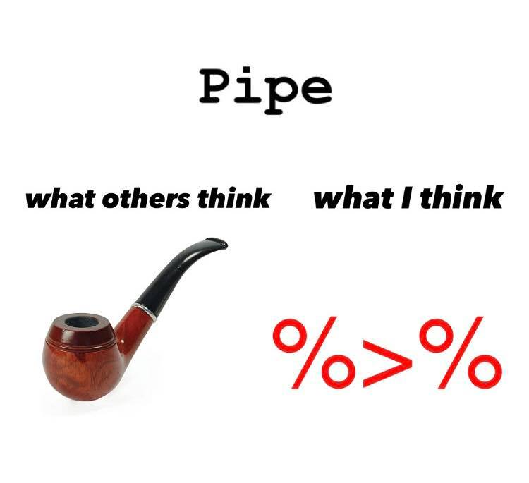
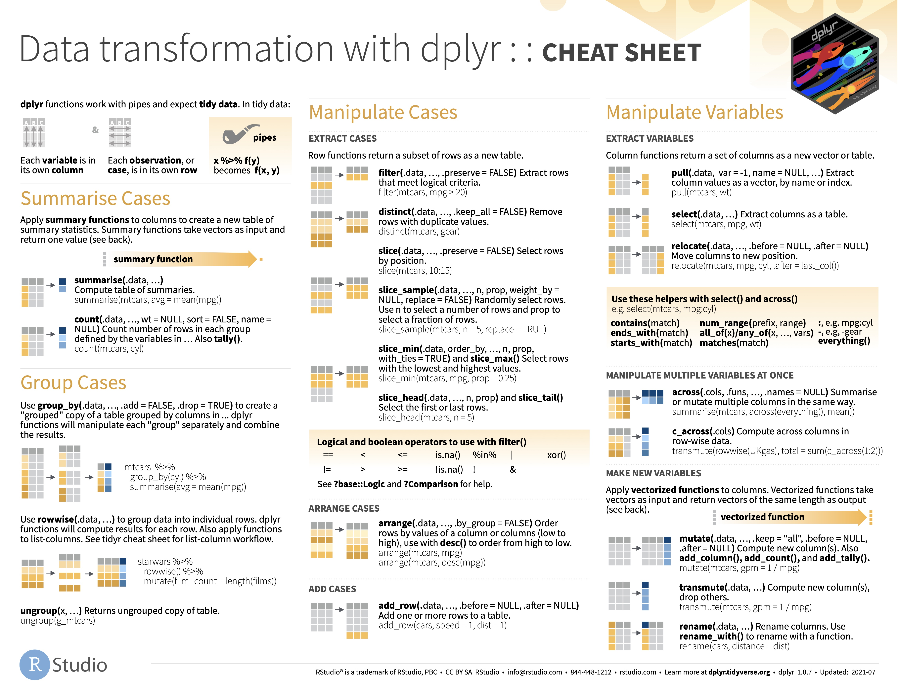
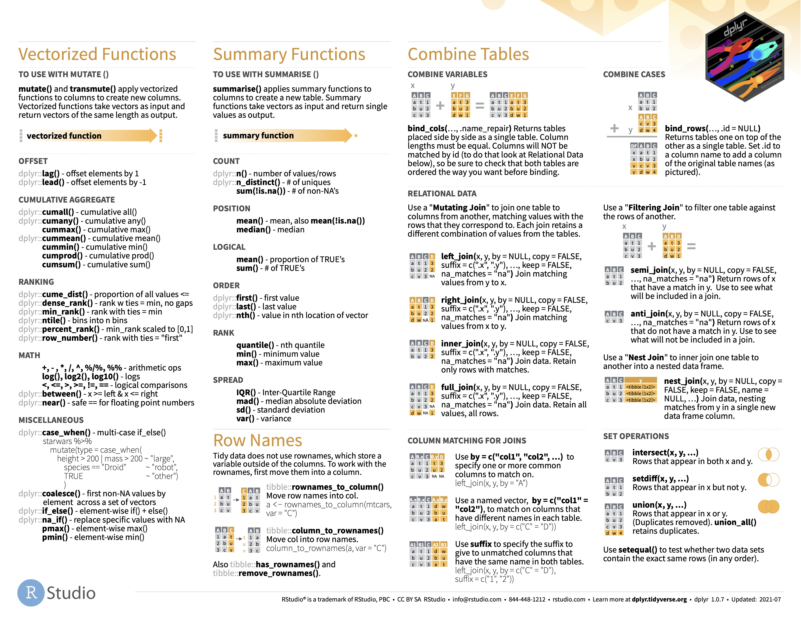

background-image: url("tidyverse_files/tidyverse-intro.png")
background-position: center
background-size: contain

# The tidyverse

???

tidyverse.org

```{css, echo=FALSE}
.red { color: red; }
.blue { color: #378C95; }
strong { color: red; }
a { color: #378C95; font-weight: bold; }
.remark-inline-code { font-weight: 900; background-color: #a7d5e7; }
.caption { color: #378C95; font-style: italic; text-align: center; }

.content-box { 
box-sizing: content-box;
background-color: #378C95;
/* Total width: 160px + (2 * 20px) + (2 * 8px) = 216px
Total height: 80px + (2 * 20px) + (2 * 8px) = 136px
Content box width: 160px
Content box height: 80px */
}

.content-box-green {
background-color: #d9edc2;
}

.content-box-red {
background-color: #f9dbdb;
}

.fullprice {
    text-decoration: line-through;
}
```

```{r xaringan-themer, include=FALSE, warning=FALSE}
library(xaringanthemer)
library(knitr)
library(granatlib)
library(emo)
style_mono_accent(
  base_color = "#DC322F",               # bright red
  inverse_background_color = "#002B36", # dark dark blue
  inverse_header_color = "#378C95",     # light aqua green
  inverse_text_color = "#FFFFFF",       # white
  title_slide_background_color = "var(--base)",
  text_font_google = google_font("Kelly Slab"),
  header_font_google = google_font("Oleo Script")
)

xaringanExtra::use_panelset()
xaringanExtra::html_dependency_clipboard()
xaringanExtra::html_dependency_scribble(pen_color = "#378C95", 3, 4)
xaringanExtra::use_tile_view()
```

```{r setup, include=FALSE}
options(htmltools.dir.version = FALSE)
knitr::opts_chunk$set(echo = TRUE, fig.align = "center")
```

---

# The tidyverse

`Tidyverse` contains the most important packages that you're likely to use in everyday data analyses:

-   [ggplot2](https://ggplot2.tidyverse.org/), for data visualisation.

-   [dplyr](https://dplyr.tidyverse.org/), for data manipulation.

-   [tidyr](https://tidyr.tidyverse.org/), for **tidy** data.

-   [readr](https://readr.tidyverse.org/), for data import.

--

-   [purrr](https://purrr.tidyverse.org/), for functional programming.

-   [tibble](https://tibble.tidyverse.org/), for tibbles (modernized data frames).

-   [stringr](https://github.com/tidyverse/stringr), for strings.

-   [forcats](https://github.com/tidyverse/forcats), for factors.

--

> "The tidyverse also includes many other packages with more specialised usage. They are not loaded automatically with library(tidyverse), so you’ll need to load each one with its own call to library()."

---

# The tidyverse

Tidyverse works similarly to any other package, but when activated, **8 packages** are activated at the same time. The following message should appear then on the console:

```{r message=TRUE, warning=TRUE}
library(tidyverse)
```
---

background-image: url("tidyverse_files/meme_pipe.gif")
background-position: center
background-size: cover
class: inverse

???

raw source for the gif: https://www.youtube.com/watch?v=aWzlQ2N6qqg

---

# The pipe

> "The magrittr (to be pronounced with a sophisticated french accent) package has two aims: decrease development time and **improve readability** and maintainability of code. Or even shortr: make your code smokin’ (puff puff)! 

> To achieve its humble aims, magrittr (remember the accent) provides a new “pipe”-like operator, **%>%**, with which you may **pipe** a **value forward into an expression or function call**; something along the lines of **x %>% f**, rather than **f(x)**. This is not an unknown feature elsewhere; a prime example is the .blue[|>] operator used extensively in F# (to say the least) and indeed this – along with Unix pipes – served as a motivation for developing the magrittr package."

Source: [Package description](https://magrittr.tidyverse.org/articles/magrittr.html)

```{r fig.align='center', out.height="170px", out.width="200px", echo=FALSE}

```

???

source of figure: https://www.facebook.com/statsystem/photos/pb.100029658941599.-2207520000../464780511996119/?type=3

---

# The pipe

- You can an insert a pipe operatior by `ctrl + shift + M` / `command + shift + M`

- To understand its relevance, you should think about it like telling **... then** to the program

<p align="center"><iframe width="560" height="315" src="https://www.youtube.com/embed/8SGif63VW6E?start=2249" title="YouTube video player" frameborder="0" allow="accelerometer; autoplay; clipboard-write; encrypted-media; gyroscope; picture-in-picture" allowfullscreen></iframe></p>

---

# The pipe - an example

Lets return to the `fertility_df` data frame.

```{r message=FALSE}
fertility_df <- read_csv("https://stats.oecd.org/sdmx-json/data/DP_LIVE/.FERTILITY.../OECD?contentType=csv&detail=code&separator=comma&csv-lang=en")
```

```{r}
fertility_df
```

---

# The pipe - an example

Lets take an example with the following two functions from the {dplyr} package:

- `filter()` subset a data frame, retaining all rows that satisfy your conditions

- `count()` count the unique values of one or more variables

.blue[How many observations are there by years that are above 2.1?]

--

Step 1. Filter to rows where `Value >= 2.1`

```{r eval=FALSE}
filter(.data = fertility_df, Value >= 2.1)
```

--

.content-box-green[
HINT: Unlike python or base R, in the case of dplyr functions, you can simply refer to the names of the variables without using "" or specifying the data frame.
]

---

# The pipe - an example

```{r eval=FALSE}
filter(.data = fertility_df, Value >= 2.1)
```

The following is identical with pipe. (The outcome before the `%>%` is the first unspecified input of the next expression)

```{r}
fertility_df %>% 
  filter(Value >= 2.1)
```

---

# The pipe - an example

Without the `%>%` 2 possiblities exist to use the result of the `filter` in the `count` function

#### 1 Assigning a new data frame

```{r eval=FALSE}
fertility_df2 <- filter(fertility_df, Value >= 2.1)
count(fertility_df2, TIME)
```

#### 2 Unreadable nesting

```{r}
count(filter(fertility_df, Value >= 2.1), TIME)
```

---

# The pipe - an example

With the `%>%`:

```{r}
fertility_df %>% 
  filter(Value >= 2.1) %>% # "... and after the filtering ..."
  count(TIME)
```

--

**There is no additional unnecessary object in the env, and the code readable**

---

background-image: url("tidyverse_files/dplyr_logo.png")
background-position: center
background-size: contain

---

## HINT: [CHEATSHEETS](https://github.com/rstudio/cheatsheets)

```{r echo=FALSE}

```

---

## HINT: [CHEATSHEETS](https://github.com/rstudio/cheatsheets)

```{r echo=FALSE}

```


