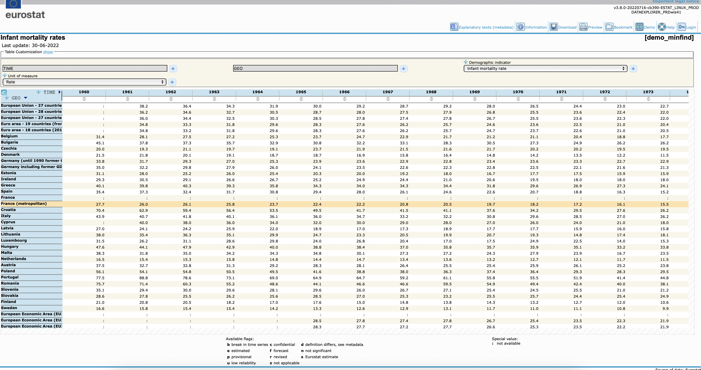

background-image: url("tidyverse_files/tidyverse-intro.png")
background-position: center
background-size: contain

# The tidyverse

???

tidyverse.org

```{css, echo=FALSE}
.red { color: red; }
.blue { color: #378C95; }
strong { color: red; }
a { color: #378C95; font-weight: bold; }
.remark-inline-code { font-weight: 900; background-color: #a7d5e7; }
.caption { color: #378C95; font-style: italic; text-align: center; }

.content-box { 
box-sizing: content-box;
background-color: #378C95;
/* Total width: 160px + (2 * 20px) + (2 * 8px) = 216px
Total height: 80px + (2 * 20px) + (2 * 8px) = 136px
Content box width: 160px
Content box height: 80px */
}

.content-box-green {
background-color: #d9edc2;
}

.content-box-red {
background-color: #f9dbdb;
}

.fullprice {
text-decoration: line-through;
}
```

```{r xaringan-themer, include=FALSE, warning=FALSE}
library(xaringanthemer)
library(knitr)
library(granatlib)
library(emo)
style_mono_accent(
  base_color = "#DC322F",               # bright red
  inverse_background_color = "#002B36", # dark dark blue
  inverse_header_color = "#378C95",     # light aqua green
  inverse_text_color = "#FFFFFF",       # white
  title_slide_background_color = "var(--base)",
  text_font_google = google_font("Kelly Slab"),
  header_font_google = google_font("Oleo Script")
)

xaringanExtra::use_panelset()
xaringanExtra::html_dependency_clipboard()
xaringanExtra::html_dependency_scribble(pen_color = "#378C95", 3, 4)
xaringanExtra::use_tile_view()
```

```{r setup, include=FALSE}
options(htmltools.dir.version = FALSE)
knitr::opts_chunk$set(echo = TRUE, fig.align = "center", error = TRUE)
```

---

# The tidyverse

`Tidyverse` contains the most important packages that you're likely to use in everyday data analyses:

-   [ggplot2](https://ggplot2.tidyverse.org/), for data visualisation.

-   [dplyr](https://dplyr.tidyverse.org/), for data manipulation.

-   [tidyr](https://tidyr.tidyverse.org/), for **tidy** data.

-   [readr](https://readr.tidyverse.org/), for data import.

--

-   [purrr](https://purrr.tidyverse.org/), for functional programming.

-   [tibble](https://tibble.tidyverse.org/), for tibbles (modernized data frames).

-   [stringr](https://github.com/tidyverse/stringr), for strings.

-   [forcats](https://github.com/tidyverse/forcats), for factors.

--

> "The tidyverse also includes many other packages with more specialised usage. They are not loaded automatically with library(tidyverse), so you’ll need to load each one with its own call to library()."

---

# The tidyverse

Tidyverse works similarly to any other package, but when activated, **8 packages** are activated at the same time. The following message should appear then on the console:

```{r message=TRUE, warning=TRUE}
library(tidyverse)
```
---

background-image: url("tidyverse_files/meme_pipe.gif")
background-position: center
background-size: cover
class: inverse

???

raw source for the gif: https://www.youtube.com/watch?v=aWzlQ2N6qqg

---

# The pipe

> "The magrittr (to be pronounced with a sophisticated french accent) package has two aims: decrease development time and **improve readability** and maintainability of code. Or even shortr: make your code smokin’ (puff puff)! 

> To achieve its humble aims, magrittr (remember the accent) provides a new “pipe”-like operator, **%>%**, with which you may **pipe** a **value forward into an expression or function call**; something along the lines of **x %>% f**, rather than **f(x)**. This is not an unknown feature elsewhere; a prime example is the .blue[|>] operator used extensively in F# (to say the least) and indeed this – along with Unix pipes – served as a motivation for developing the magrittr package."

Source: [Package description](https://magrittr.tidyverse.org/articles/magrittr.html)

```{r fig.align='center', out.height="170px", out.width="200px", echo=FALSE}
include_graphics("tidyverse_files/pipe_meme2.jpg")
```

???

source of figure: https://www.facebook.com/statsystem/photos/pb.100029658941599.-2207520000../464780511996119/?type=3

---

# The pipe

- You can an insert a pipe operatior by `ctrl + shift + M` / `command + shift + M`

- To understand its relevance, you should think about it like telling **... then** to the program

<p align="center"><iframe width="560" height="315" src="https://www.youtube.com/embed/8SGif63VW6E?start=2249" title="YouTube video player" frameborder="0" allow="accelerometer; autoplay; clipboard-write; encrypted-media; gyroscope; picture-in-picture" allowfullscreen></iframe></p>

---

# The pipe - an example

Lets return to the `fertility_df` data frame.

```{r eval=FALSE}
fertility_df <- read_csv("https://stats.oecd.org/sdmx-json/data/DP_LIVE/.FERTILITY.../OECD?contentType=csv&detail=code&separator=comma&csv-lang=en")
```

```{r echo=FALSE, message=FALSE}
fertility_df <- read_csv("introduction-to-r_files/DP_LIVE_18092022133955414.csv")
```

```{r}
fertility_df
```

---

# The pipe - an example

Lets take an example with the following two functions from the {dplyr} package:

- `filter()` subset a data frame, retaining all rows that satisfy your conditions

- `count()` count the unique values of one or more variables

.blue[How many observations are there by years that are above 2.1?]

--

Step 1. Filter to rows where `Value >= 2.1`

```{r eval=FALSE}
filter(.data = fertility_df, Value >= 2.1)
```

--

.content-box-green[
HINT: Unlike python or base R, in the case of dplyr functions, you can simply refer to the names of the variables without using "" or specifying the data frame.
]

---

# The pipe - an example

```{r eval=FALSE}
filter(.data = fertility_df, Value >= 2.1)
```

The following is identical with pipe. (The outcome before the `%>%` is the first unspecified input of the next expression)

```{r}
fertility_df %>% 
  filter(Value >= 2.1)
```

---

# The pipe - an example

Without the `%>%` 2 possibilities exist to use the result of the `filter` in the `count` function

#### 1 Assigning a new data frame

```{r eval=FALSE}
fertility_df2 <- filter(fertility_df, Value >= 2.1)
count(fertility_df2, TIME)
```

#### 2 Unreadable nesting

```{r}
count(filter(fertility_df, Value >= 2.1), TIME)
```

---

# The pipe - an example

With the `%>%`:

```{r eval=FALSE}
fertility_df %>% 
  filter(Value >= 2.1) %>% # "... and after the filtering ..."
  count(TIME)
```

.pull-left[
```{r eval=TRUE, echo=FALSE}
fertility_df %>% 
  filter(Value >= 2.1) %>% # "... and after the filtering ..."
  count(TIME)
```
]

.pull-right[
```{r echo=FALSE}

```
]

--

**No additional unnecessary object in the env, and the code readable**

---

background-image: url("tidyverse_files/dplyr_logo.png")
background-position: center
background-size: contain

---

## HINT: [CHEATSHEETS](https://github.com/rstudio/cheatsheets)

```{r echo=FALSE}
include_graphics("tidyverse_files/data-transformation - 01.jpg")
```

---

## HINT: [CHEATSHEETS](https://github.com/rstudio/cheatsheets)

```{r echo=FALSE}
include_graphics("tidyverse_files/data-transformation - 02.jpg")
```

---

# Manipulate - select


--

`select()`  Extract the specified columns as a table.

```{r eval=FALSE}
select(.data = fertility_df, LOCATION, TIME, Value)
```

.pull-left[
```{r echo=FALSE}
fertility_df %>% 
  select(LOCATION, TIME, Value) # using col names
```
]

.pull-right[

#### Identical outcome

```{r eval=FALSE}
fertility_df %>% 
  select(LOCATION, TIME, Value)
```

```{r eval=FALSE}
fertility_df %>% 
  select(1, 6:7)
```

```{r eval=FALSE}
fertility_df %>% 
  select(- (2:5), -`Flag Codes`)
```
]

---

# Manipulate - rename

`rename()` Rename columns.

```{r eval=FALSE}
fertility_df %>% 
  select(LOCATION, TIME, Value) %>% 
  rename(geo = LOCATION, fertility = Value)
```

.pull-left[
```{r echo=FALSE}
fertility_df %>% 
  select(LOCATION, TIME, Value) %>% 
  rename(geo = LOCATION, fertility = Value)
```
]

--

.pull-right[

.content-box-green[
HINT: You can do it in 1 single step.
]

```{r eval=FALSE}
fertility_df %>% 
  select(
    geo = LOCATION, 
    TIME,
    fertility = Value
  )
```
]

---

# Manipulate - mutate

`mutate()` Compute new column(s).

`countrycode::countrycode()`  Translates from one contry name scheme to another. 

```{r eval=FALSE}
library(countrycode)

fertility_df %>% 
  select(LOCATION, TIME, Value) %>% 
* mutate(
    country_name = countrycode(LOCATION, "iso3c", "country.name"),
    continent = countrycode(LOCATION, "iso3c", "continent")
  )
```

```{r echo=FALSE, message=FALSE, warning=FALSE}
library(countrycode)

fertility_df %>% 
  select(LOCATION, TIME, Value) %>% 
  mutate(
    country_name = countrycode(LOCATION, "iso3c", "country.name"),
    continent = countrycode(LOCATION, "iso3c", "continent"),
    LOCATION = countrycode(LOCATION, "iso3c", "iso2c")
  )
```

---

# Manipulate - mutate

.content-box-red[
WARNING: If you specify a single value instead of a vector, then the values will be repeated by the number of rows.
]

```{r}
fertility_df %>% 
  select(LOCATION, TIME, Value) %>% 
  mutate(avg_fertility = mean(Value))
```

---

# Manipulate - ifelse

`ifelse()` returns a vector filled with elements selected from either yes or no depending on the condition.

```{r eval=FALSE}
fertility_df %>% 
  select(LOCATION, TIME, Value) %>% 
  mutate(
    avg_fertility = mean(Value),
    above_avg = Value > avg_fertility,
*   high = ifelse(above_avg, "yes, above the avg", "no")
  )
```

```{r echo=FALSE}
fertility_df %>% 
  select(LOCATION, TIME, Value) %>% 
  mutate(
    avg_fertility = mean(Value),
    above_avg = Value > avg_fertility,
    high = ifelse(above_avg, "yes, above the avg", "no")
  )
```

---

# Manipulate - ifelse

`ifelse()` returns a vector filled with elements selected from either yes or no depending on the condition.

```{r eval=FALSE}
fertility_df %>% 
  select(LOCATION, TIME, Value) %>% 
  mutate(
    avg_fertility = mean(Value),
    above_avg = Value > avg_fertility,
    high = ifelse(above_avg, "yes, above the avg", "no")
  )
```

With a single step

```{r eval=FALSE}
fertility_df %>% 
  select(LOCATION, TIME, Value) %>% 
  mutate(
*   high = ifelse(Value > mean(value), "yes, above the avg", "no")
  )
```

---

# Manipulate - case_when

`case_when()` Vectorise multiple if_else() statements (return the first value associated with TRUE condition)

```{r eval=FALSE}
fertility_df %>% 
  select(LOCATION, TIME, Value) %>% 
  mutate(
*     fertility_level = case_when(
      Value >= 5 ~ "very high",
      Value >= 3 ~ "high", 
      Value >= 2.1 ~ "above replacement r",
      Value >= 1.3 ~ "below replacemnt r",
      TRUE ~ "very low"
    )
  )
```

```{r echo=FALSE}
fertility_df %>% 
  select(LOCATION, TIME, Value) %>% 
  mutate(
    fertility_level = case_when(
      Value >= 5 ~ "very high",
      Value >= 3 ~ "high", 
      Value >= 2.1 ~ "above replacement r",
      Value >= 1.3 ~ "below replacemnt r",
      TRUE ~ "very low" # if none were TRUE
    )
  ) %>% 
  distinct(fertility_level, .keep_all = TRUE) %>% 
  knitr::kable()
```

---

# Manipulate - transmute

`transmute()` Compute new column(s), drop others. (= select + mutate)

```{r eval=FALSE}
fertility_df %>% 
* transmute(LOCATION, TIME, 
              fertility_level = case_when(
                Value >= 5 ~ "very high",
                Value >= 3 ~ "high", 
                Value >= 2.1 ~ "above replacement r",
                Value >= 1.3 ~ "below replacemnt r",
                TRUE ~ "very low" 
              )
  )
```

```{r echo=FALSE}
fertility_df %>% 
  transmute(LOCATION, TIME, 
            fertility_level = case_when(
              Value >= 5 ~ "very high",
              Value >= 3 ~ "high", 
              Value >= 2.1 ~ "above replacement r",
              Value >= 1.3 ~ "below replacemnt r",
              TRUE ~ "very low" 
            )
  )
```

---

# Manipulate - filter

`filter()` Extract rows that meet logical criteria.

```{r}
fertility_df %>% 
  filter(LOCATION != "EU" & LOCATION != "OAVG")
```

---

# Manipulate - slice

`slice()` Select rows by positiion

```{r}
fertility_df %>% 
  slice(1:3)
```

---

# Manipulate - arrange

`arrange()` Order rows by values of a column or columns (low to high), use with `desc()` to order from high to low.

.pull-left[
```{r eval=FALSE}
fertility_df %>% 
  select(LOCATION, TIME, 
         Value) %>% 
* arrange(Value)
```

```{r echo=FALSE}
fertility_df %>% 
  select(LOCATION, TIME, Value) %>% 
  arrange(Value)
```
]

.pull-right[
```{r eval=FALSE}
fertility_df %>% 
  select(LOCATION, TIME, 
         Value) %>% 
* arrange(desc(Value))
```

```{r echo=FALSE}
fertility_df %>% 
  select(LOCATION, TIME, Value) %>% 
  arrange(desc(Value))
```
]

---

# Manipulate - group_by & summarise

`group_by()` Create a "grouped" copy of a table.

`summarise()` Compute table of summaries.

```{r eval=FALSE}
fertility_df %>% 
* group_by(LOCATION)
```

```{r echo=FALSE}
fertility_df %>% 
  group_by(LOCATION)
```

---

# Manipulate - group_by & summarise

`group_by()` Create a "grouped" copy of a table.

`summarise()` Compute table of summaries.

```{r eval=FALSE}
fertility_df %>% 
  group_by(LOCATION) %>% 
* summarise(avg_fertility = mean(Value))
```

```{r echo=FALSE}
fertility_df %>% 
  group_by(LOCATION) %>% 
  summarise(avg_fertility = mean(Value))
```

---

# Manipulate - group_by & summarise

`group_by()` Create a "grouped" copy of a table.

`summarise()` Compute table of summaries.

#### Example - number of observations

.pull-left[

```{r eval=FALSE}
fertility_df %>% 
  group_by(LOCATION) %>% 
* summarise(n_obs = n())
```

```{r echo=FALSE}
fertility_df %>% 
  group_by(LOCATION) %>% 
  summarise(n_obs = n())
```
]

.pull-right[
You can also replicate it with the `count()` fn.

```{r}
fertility_df %>% 
  count(LOCATION)
```

]

---

# Manipulate - group_by & summarise

`group_by()` Create a "grouped" copy of a table.

`summarise()` Compute table of summaries.

.content-box-red[
Every other manipulation will behave differently if the data frame is grouped.
]


```{r eval=FALSE}
fertility_df %>% 
  select(LOCATION, TIME, Value) %>% 
  group_by(LOCATION) %>% 
* mutate(avg_fertility = mean(Value)) %>% 
* slice(1:3)
```

--

```{r echo=FALSE}
fertility_df %>% 
  select(LOCATION, TIME, Value) %>% 
  group_by(LOCATION) %>% 
  mutate(avg_fertility = mean(Value)) %>% 
  slice(1:3)
```

---

## Exercise

.blue[In which decade did the average fertility rate of European countries decrease the most? (in absolute magnitude)]

.content-box-green[
HINT: use the `first()` and the `last()` fn to calculate difference in a period.
]

--

```{r eval=FALSE}
fertility_df %>% 
  select(LOCATION, TIME, Value) %>% 
  filter(countrycode(LOCATION, "iso3c", "continent") == "Europe") %>% 
  group_by(TIME) %>% 
  summarise(avg_fertility = mean(Value)) %>% 
  arrange(TIME) %>% 
* mutate(decade = (TIME %/% 10) * 10) %>% 
  group_by(decade) %>% 
* summarise(d_fertility = last(avg_fertility) - first(avg_fertility)) %>% 
  arrange(d_fertility)
```

```{r echo=FALSE, warning=FALSE, message=FALSE}
fertility_df %>% 
  select(LOCATION, TIME, Value) %>% 
  filter(countrycode(LOCATION, "iso3c", "continent") == "Europe") %>% 
  group_by(TIME) %>% 
  summarise(avg_fertility = mean(Value)) %>% 
  arrange(TIME) %>% 
  mutate(decade = (TIME %/% 10) * 10) %>% 
  group_by(decade) %>% 
  summarise(d_fertility = last(avg_fertility) - first(avg_fertility)) %>% 
  arrange(d_fertility)
```

---

# ..._if, ..._at, ..._all

Some of the previously listed functions have extended versions

--

### Select all columns where the condition is TRUE

```{r}
fertility_df %>% 
  select_if(is.numeric)
```

---

# ..._if, ..._at, ..._all

Some of the previously listed functions have extended versions


### Modify all columns where the condition is true

HINT: mainly you will use quosure style lambda functions here. This means that after `~`, you can refer with `.` to the current element.

```{r}
fertility_df %>% 
  mutate_if(is.numeric, ~ . * 10)
```

---

class: inverse, middle, center

## The {dplyr} functions will return in the next episodes of the tidyverse.

---

background-image: url("tidyverse_files/tidyr-logo.png")
background-position: center
background-size: contain

---

# Pivot_wider

Datasets are in long on wide format (but never in the currently desired one `ji("laugh")`)

(The following example is the one we saw last week to present the apply functions. In STATA you mainly operate with tables in wide format)

```{r}
fertility_wide <- fertility_df %>% 
  select(LOCATION, TIME, Value) %>% 
  pivot_wider(names_from = LOCATION, values_from = Value)

fertility_wide
```

---

# Pivot_longer

Yes, `pivot_longer` is to convert back the table into long format.

```{r}
fertility_wide %>% 
  pivot_longer(
    cols = - 1, # all except the 1st
    # 2:last_col()
    # AUS, AUT, ... also work
    names_to = "LOCATION",
    values_to = "fertility"
  )
```

---

### Example

Lets download the [infant mortality rates from Eurostat](https://appsso.eurostat.ec.europa.eu/nui/submitViewTableAction.do) (in Excel format) and link it with the `fertility_df`

```{r echo=FALSE}

```

---

```{r message=FALSE, warning=FALSE}
infant_mortality_df <- readxl::read_excel("tidyverse_files/demo_minfind.xls")
```

The issue here is that there are multiple tables on the first sheet (not a rare thing).

```{r}
infant_mortality_df
```

---

### Example

After exploring the data, you may realize that the name of the data is always in the second column. Our table starts after where find the "Infant mortality rate". 

```{r}
pull(infant_mortality_df, 2) # 2nd column as vector
```

---

### Example

After exploring the data, you may realise that the name of the data is always in the second column. Our data starts where find we the "Infant mortality rate". The first row of the table where we find "GEO/TIME" in the first column

```{r}
data_start_index <- pull(infant_mortality_df, 2) %>%
  purrr::detect_index(~ . == "Infant mortality rate" & !is.na(.))

data_start_index
```

```{r}
start_index <- pull(infant_mortality_df, 1) %>% 
  {. == "GEO/TIME" & !is.na(.)} %>% 
  which() %>% 
  detect(~ . > data_start_index)
```


--

And ends at the next empty cell (not ":")

```{r}
end_index <- pull(infant_mortality_df, 2) %>% 
  is.na() %>%
  which() %>% 
  detect(~ . > start_index)
```

---

### Example

```{r}
infant_mortality_df %>% 
  slice(start_index:end_index)
```

---

### Example

.content-box-green[
HINT: If the colnames are not tidy or they are threated as observation, then use the {janitor} package.
]

--

```{r}
infant_mortality_df %>% 
  slice(start_index:end_index) %>% 
  janitor::row_to_names(1)
```

---

### Example

Next issue: All columns are in character format

--

```{r eval=FALSE}
infant_mortality_df %>% 
  slice(start_index:end_index) %>% 
  janitor::row_to_names(1) %>% 
* mutate_at(- 1, as.numeric) # all except the 1st col
```

```{r echo=FALSE, message=FALSE, warning=FALSE}
infant_mortality_df %>% 
  slice(start_index:end_index) %>% 
  janitor::row_to_names(1) %>% 
  mutate_at(- 1, as.numeric) # all except the 1st col
```

---

### Example

And now lets transform it into long format.

--

```{r eval=FALSE}
infant_mortality_df %>% 
  slice(start_index:end_index) %>% 
  janitor::row_to_names(1) %>% 
  mutate_at(- 1, as.numeric) %>% 
* pivot_longer(- 1, names_to = "TIME", 
                 values_to = "infant_mortality")
```

```{r echo=FALSE, message=FALSE, warning=FALSE}
infant_mortality_df %>% 
  slice(start_index:end_index) %>% 
  janitor::row_to_names(1) %>% 
  mutate_at(- 1, as.numeric) %>% 
  pivot_longer(- 1, names_to = "TIME", values_to = "infant_mortality")
```

---

### Example

Lets filter out aggregates and irrelevant.

--

```{r eval=FALSE}
infant_mortality_df %>% 
  slice(start_index:end_index) %>% 
  janitor::row_to_names(1) %>% 
  mutate_at(- 1, as.numeric) %>% 
  pivot_longer(- 1, names_to = "TIME", 
               values_to = "infant_mortality") %>% 
  rename(geo = `GEO/TIME`) %>% 
  mutate(
*   geo = countrycode(geo, "country.name", "iso3c"),
* ) %>% 
* filter(!is.na(geo))
```

```{r echo = FALSE, message=FALSE, warning=FALSE}
filtered_geo <- infant_mortality_df %>% 
  slice(start_index:end_index) %>% 
  janitor::row_to_names(1) %>% 
  mutate_at(- 1, as.numeric) %>% 
  pivot_longer(- 1, names_to = "TIME", 
               values_to = "infant_mortality") %>% 
  rename(geo = `GEO/TIME`) %>% 
  mutate(
    geo_code = countrycode(geo, "country.name", "iso3c"),
  ) %>% 
  filter(is.na(geo_code)) %>% 
  distinct(geo) %>% 
  pull() %>% 
  {ifelse(is.na(.), "NA", .)}
```

This code filters out the rows where geo is in: .blue[`r filtered_geo`]

--

**Enough?**

---

### Example

`count()` Quickly count the unique values of one or more variables

```{r eval=FALSE}
infant_mortality_df %>% 
  slice(start_index:end_index) %>% 
  janitor::row_to_names(1) %>% 
  mutate_at(- 1, as.numeric) %>% 
  pivot_longer(- 1, names_to = "TIME", 
               values_to = "infant_mortality") %>% 
  rename(geo = `GEO/TIME`) %>% 
  mutate(
    geo = countrycode(geo, "country.name", "iso3c"),
  ) %>% 
  filter(!is.na(geo)) %>% 
* count(geo, sort = TRUE)
```

```{r echo=FALSE, message=FALSE, warning=FALSE}
infant_mortality_df %>% 
  slice(start_index:end_index) %>% 
  janitor::row_to_names(1) %>% 
  mutate_at(- 1, as.numeric) %>% 
  pivot_longer(- 1, names_to = "TIME", 
               values_to = "infant_mortality") %>% 
  rename(geo = `GEO/TIME`) %>% 
  mutate(
    geo = countrycode(geo, "country.name", "iso3c"),
  ) %>% 
  filter(!is.na(geo)) %>% 
  count(geo, sort = TRUE)
```

---

### Example

Remove the irrelevant duplication & convert `TIME` to numeric

```{r eval=FALSE}
infant_mortality_df %>% 
  slice(start_index:end_index) %>% 
  janitor::row_to_names(1) %>% 
  mutate_at(- 1, as.numeric) %>% 
  pivot_longer(- 1, names_to = "TIME", 
               values_to = "infant_mortality") %>% 
  rename(geo = `GEO/TIME`) %>% 
* filter(
*   geo != "France (metropolitan)" &
*     geo != "Germany (until 1990 former territory of the FRG)"
* ) %>% 
mutate(
  geo = countrycode(geo, "country.name", "iso3c"),
* TIME = as.numeric(TIME)
) %>% 
  filter(!is.na(geo)) 
```

```{r echo=FALSE, message=FALSE, warning=FALSE}
infant_mortality_df %>% 
  slice(start_index:end_index) %>% 
  janitor::row_to_names(1) %>% 
  mutate_at(- 1, as.numeric) %>% 
  pivot_longer(- 1, names_to = "TIME", 
               values_to = "infant_mortality") %>% 
  rename(geo = `GEO/TIME`) %>% 
  filter(
    geo != "France (metropolitan)" &
      geo != "Germany (until 1990 former territory of the FRG)"
  ) %>% 
mutate(
  geo = countrycode(geo, "country.name", "iso3c"),
  TIME = as.numeric(TIME)
) %>% 
  filter(!is.na(geo)) 
```

---

# Example

Assing it with the same name (re-write the table)

```{r eval=FALSE}
*infant_mortality_df <- infant_mortality_df %>% 
  slice(start_index:end_index) %>% 
  janitor::row_to_names(1) %>% 
  mutate_at(- 1, as.numeric) %>% 
  pivot_longer(- 1, names_to = "TIME", 
               values_to = "infant_mortality") %>% 
  rename(geo = `GEO/TIME`) %>% 
  filter(
    geo != "France (metropolitan)" &
      geo != "Germany (until 1990 former territory of the FRG)"
  ) %>% 
mutate(
  geo = countrycode(geo, "country.name", "iso3c"),
  TIME = as.numeric(TIME)
) %>% 
  filter(!is.na(geo)) 
```

```{r echo=FALSE, message=FALSE, warning=FALSE}
infant_mortality_df <- infant_mortality_df %>% 
  slice(start_index:end_index) %>% 
  janitor::row_to_names(1) %>% 
  mutate_at(- 1, as.numeric) %>% 
  pivot_longer(- 1, names_to = "TIME", 
               values_to = "infant_mortality") %>% 
  rename(geo = `GEO/TIME`) %>% 
  filter(
    geo != "France (metropolitan)" &
      geo != "Germany (until 1990 former territory of the FRG)"
  ) %>% 
mutate(
  geo = countrycode(geo, "country.name", "iso3c"),
  TIME = as.numeric(TIME)
) %>% 
  filter(!is.na(geo)) 
```

---

# Example

Let's transform fertility_df to a similar format

--

```{r}
fertility_df <- fertility_df %>% 
  select(
    geo = LOCATION, TIME, fertility = Value
  )
```

--

Now we need to link the two tables.

```{r}
full_join(x = fertility_df, y = infant_mortality_df)
```

---

# Mutating joins

Using the `full_join` fn a message appeared: `Joining, by = c("geo", "TIME")`. The fn linked the two datasets based on the identical names (keys). But what happens if a given value can be found only in one table? We have 4 options to that:

- inner_join(): includes all rows in x and y.

- left_join(): includes all rows in x.

- right_join(): includes all rows in y.

- full_join(): includes all rows in x or y.

---


