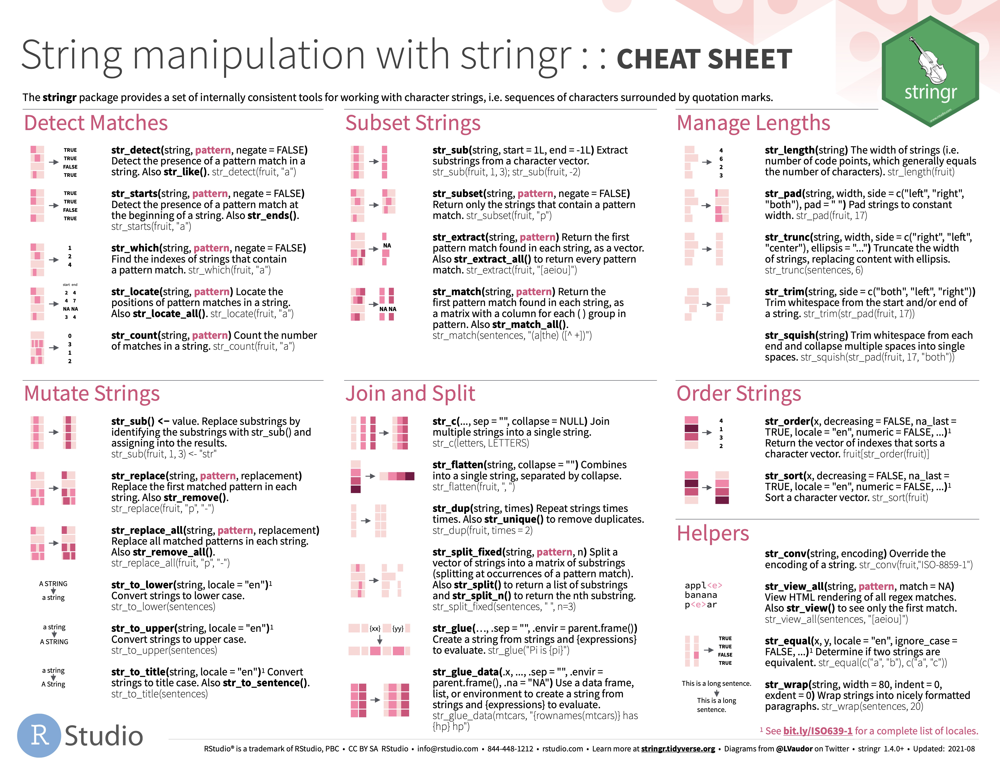
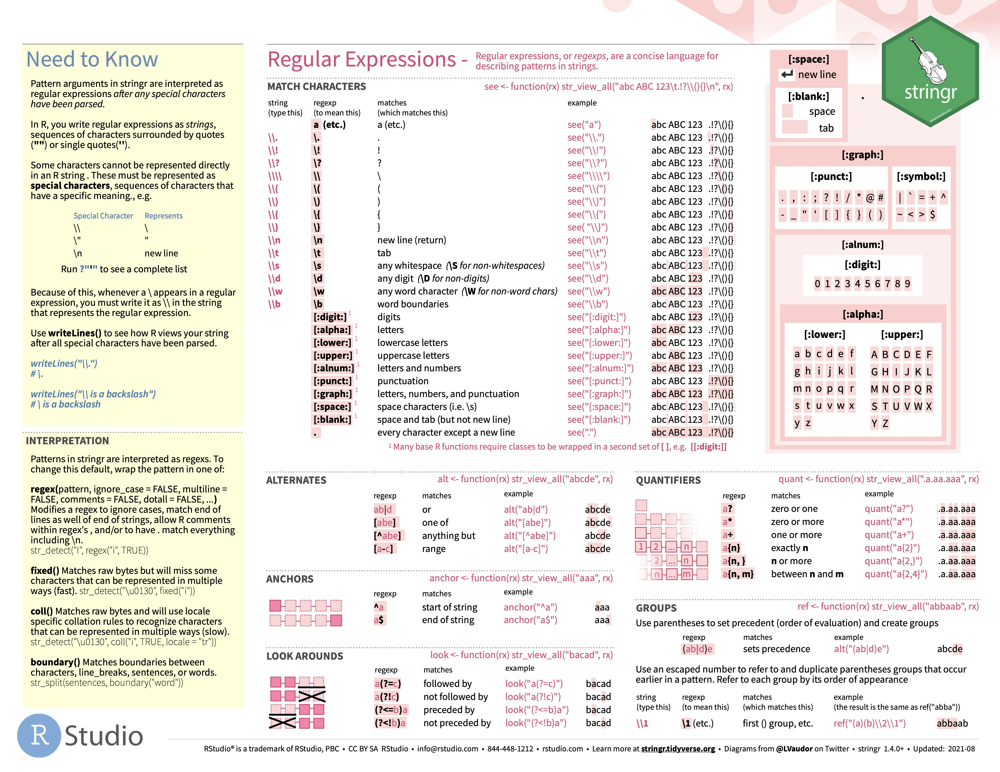

```{css, echo=FALSE}
.red { color: red; }
.blue { color: #378C95; }
strong { color: red; }
a { color: #378C95; font-weight: bold; }
.remark-inline-code { font-weight: 900; background-color: #a7d5e7; }
.caption { color: #378C95; font-style: italic; text-align: center; }

.content-box { 
box-sizing: content-box;
background-color: #378C95;
/* Total width: 160px + (2 * 20px) + (2 * 8px) = 216px
Total height: 80px + (2 * 20px) + (2 * 8px) = 136px
Content box width: 160px
Content box height: 80px */
}

.content-box-green {
background-color: #d9edc2;
}

.content-box-red {
background-color: #f9dbdb;
}

.fullprice {
text-decoration: line-through;
}
```

```{r xaringan-themer, include=FALSE, warning=FALSE}
library(xaringanthemer)
library(knitr)
library(granatlib)
library(emo)
library(tidyverse)
style_mono_accent(
  base_color = "#DC322F",               # bright red
  inverse_background_color = "#002B36", # dark dark blue
  inverse_header_color = "#378C95",     # light aqua green
  inverse_text_color = "#FFFFFF",       # white
  title_slide_background_color = "var(--base)",
  text_font_google = google_font("Kelly Slab"),
  header_font_google = google_font("Oleo Script")
)

xaringanExtra::use_panelset()
xaringanExtra::html_dependency_clipboard()
xaringanExtra::html_dependency_scribble(pen_color = "#378C95", 3, 4)
xaringanExtra::use_tile_view()
```

```{r setup, include=FALSE}
options(htmltools.dir.version = FALSE)
knitr::opts_chunk$set(echo = TRUE, fig.align = "center", error = TRUE)
```

# Today's .blue[Agenda]

### Session 1 - Tidyverse II.

1. {stringr} `r ji("abc")`

2. {purrr} `r ji("warning")`

### Session 2 - Inferential statistics I.

1. Concepts `r ji("writing_hand")`

2. IID mean estimation

---

background-image: url(tidyverse2_files/stringr.png)
background-size: contain

---

## HINT: [CHEATSHEETS](https://github.com/rstudio/cheatsheets)

```{r echo=FALSE}

```

---

## HINT: [CHEATSHEETS](https://github.com/rstudio/cheatsheets)

```{r echo=FALSE}

```

---

# Stringr - motivation

> All functions in stringr start with `str_` and take a **vector of strings as the first argument**.

This makes it easy to find the string manipulation function you need `r ji("happy")`

--

```{r}
courses <- c("Big data", "Behavioral economics", "Dynamic macroeconomics 2", "Communication", "Economic instituions")

courses
```

#### **C**ombine strings

```{r}
str_c(courses, " 2")
```

---

# Stringr

### Which subject is about economics?

```{r}
str_detect(courses, "economics")
```

---

# Stringr

Of course, these functions should also be used in the structure seen earlier.

```{r}
tibble(courses)
```

---

# Stringr

Of course, these functions should also be used in the structure seen earlier.

```{r eval = FALSE}
tibble(courses) %>% 
  mutate(
*  about_economics = str_detect(courses, "economic")
  )
```

```{r echo = FALSE}
tibble(courses) %>% 
  mutate(
    about_economics = str_detect(courses, "economic")
  )
```

--

.content-box-red[
If you look carefully at the outcome, you can see that these functions are **cAsE sENsItIVE** (the FALSE value in the last row).
]

---

# Stringr

#### Solution 1. - convert to lower case

```{r eval = FALSE}
tibble(courses) %>% 
  mutate(
*   courses = str_to_lower(courses),
    about_economics = str_detect(courses, "economic")
  )
```

```{r echo = FALSE}
tibble(courses) %>% 
  mutate(
    courses = str_to_lower(courses),
    about_economics = str_detect(courses, "economic")
  )
```

---

# Stringr

#### Solution 2. - detect with lower and upper case

```{r eval = FALSE}
tibble(courses) %>% 
  mutate(
*   about_economics = str_detect(courses, "economic|Economic")
  )
```

```{r echo = FALSE}
tibble(courses) %>% 
  mutate(
    about_economics = str_detect(courses, "economic|Economic")
  )
```

---

# Stringr

#### Solution 3. - detect with lower and upper first letter

```{r eval = FALSE}
tibble(courses) %>% 
  mutate(
*   about_economics = str_detect(courses, "[eE]conomic")
  )
```

```{r echo = FALSE}
tibble(courses) %>% 
  mutate(
    about_economics = str_detect(courses, "[eE]conomic")
  )
```

---

# Stringr

> Most string functions work with regular expressions, a concise language for describing patterns of text.

--

- `[eE]conomic` was an example to regular expressions (regex)

--

- Regex has a number of .blue[special characters] that we can use to describe the patterns we are looking for

--

- For example: `\\d` is for any numeric character

```{r eval = FALSE}
tibble(courses) %>% 
  mutate(
   about_economics = str_detect(courses, "economic"),
*  not_single_course = str_detect(courses, "\\d")
  )
```

```{r echo = FALSE, highlight.output=6}
tibble(courses) %>% 
  mutate(
    about_economics = str_detect(courses, "economic"),
    not_single_course = str_detect(courses, "\\d")
  )
```

---

# Stringr

`\\s` is for whitespaces (space/new line/tabulator)

```{r eval = FALSE}
tibble(courses) %>% 
  mutate(
*  contain_spaces = str_detect(courses, "\\s")
  )
```

```{r echo = FALSE, highlight.output=7}
tibble(courses) %>% 
  mutate(
    contain_spaces = str_detect(courses, "\\s")
  )
```

---

# Stringr

`\\w` is for letters (but all of them contain letters)

```{r eval = FALSE}
tibble(courses) %>% 
  mutate(
*  contain_letter = str_detect(courses, "\\w")
  )
```

```{r echo = FALSE}
tibble(courses) %>% 
  mutate(
    contain_letter = str_detect(courses, "\\w")
  )
```

---

# Stringr

.contain-box-green[
Each of the regex expressions presented previously has an opposite. The same code in upper case.
]

--

`\\W` is for non-letter characters (numbers or white-spaces)

```{r eval = FALSE}
tibble(courses) %>% 
  mutate(
*  contain_non_letter = str_detect(courses, "\\W")
  )
```

```{r echo = FALSE}
tibble(courses) %>% 
  mutate(
    contain_non_letter = str_detect(courses, "\\W")
  )
```

---

# Stringr

There are several other functions in the {stringr} package.

```{r eval = FALSE}
tibble(courses) %>% 
  mutate(
*  n_non_letter = str_count(courses, "\\W"),
*  n_character = str_length(courses)
  )
```

```{r echo = FALSE}
tibble(courses) %>% 
  mutate(
    n_non_letter = str_count(courses, "\\W"),
    n_character = str_length(courses)
  )
```

---

# Stringr

### Extract date from url

[https://economaniablog.hu/2022/09/14/how-to-forecast-the-business-cycle-sentiment-speaks/](https://economaniablog.hu/2022/09/14/how-to-forecast-the-business-cycle-sentiment-speaks/)

```{r}
x <- "https://economaniablog.hu/2022/09/14/how-to-forecast-the-business-cycle-sentiment-speaks/"
```

```{r}
str_extract(x, "20\\d\\d/\\d\\d/\\d\\d")
```

--

.content-box-green[
Those who want to work with webscraping and/or text analysis tools will really need to learn how to use the {stringr} functions!
]

---

# Stringr

[https://economaniablog.hu/2022/09/14/how-to-forecast-the-business-cycle-sentiment-speaks/](https://economaniablog.hu/2022/09/14/how-to-forecast-the-business-cycle-sentiment-speaks/)

#### Is it a website?

```{r}
str_starts(x, "https://")
```

--

#### Remove the base url, assuming that its length is always the same

```{r}
str_sub(x, end = 26)
```

---

# Stringr

[https://economaniablog.hu/2022/09/14/how-to-forecast-the-business-cycle-sentiment-speaks/](https://economaniablog.hu/2022/09/14/how-to-forecast-the-business-cycle-sentiment-speaks/)

#### Remove the base url, assuming it lasts until the date

```{r}
gsub(pattern = ".*20\\d\\d/\\d\\d/\\d\\d", replacement = "", x)
```

--

#### Remove the text after the base url, assuming it lasts until the date

```{r}
gsub(pattern = "20\\d\\d/\\d\\d/\\d\\d.*", replacement = "", x)
```

--

`gsub` also works with regular expressions. Here the `.` refers to anything, and `*` denotes any repetition. Thus `.*` before the pattern means anything before the pattern, and `.*` after the pattern means anything after the pattern. `gsub` is not a part of {string}, that is why its first argument is the pattern, not the string.

---

background-image: url(tidyverse2_files/purrr.png)
background-size: contain

---

class: inverse, middle, center

## The {stringr} functions will return in the next episodes of the tidyverse.

---


# Purrr - introduction

> "{purrr} enhances R’s functional programming (FP) toolkit by providing a complete and consistent set of tools for working with functions and vectors. If you’ve never heard of FP before, the best place to start is the family of `map()` functions which allow you to **replace many for loops** with code that is both more succinct and easier to read. The best place to learn about the `map()` functions is the iteration chapter in [R for data science](https://r4ds.had.co.nz/iteration.html)."

Source: [Package description](https://purrr.tidyverse.org)

---

# Purrr - illustrative example

Lets suppose we have multiple .csv files in our working directory. These files are generated from the app [Publish or Perish](https://harzing.com/resources/publish-or-perish) and contain google search results with different keywords. 

The files can be downloaded from [here](https://codeload.github.com/gist/4ed653c8e655d4ebabaa3071fc7b50a0/zip/5aef770bce91b661744ad8c8b1aed56643f795cf). **Unzip the files and copy into your working directory.**

--

### How to find the files in your working directory?

```{r eval = FALSE}
list.files()
```

```{r echo = FALSE}
list.files("tidyverse2_files/")
```


---

# Purrr - illustrative example

### Keep only the file names of csv files

`purrr::keep` keeps the elements, where the condition is TRUE.

```{r eval = FALSE}
file_names <- list.files() %>% 
* keep(~ str_ends(., "csv"))

file_names
```

```{r echo=FALSE}
file_names <- list.files("tidyverse2_files/") %>% 
  keep(~ str_ends(., "csv"))

file_names
```

.content-box-green[
The previously seen lambda-type (`~` & `.`) function returns again!
]

---

# Purrr - illustrative example

### Purrr - Read all the csv file at once

`purrr::map` applies a function to each element of a list or atomic vector and returns an object of the same length as the input.

```{r echo=FALSE}
read_tidyverse2_csv <- . %>% 
  str_c("tidyverse2_files/", .) %>% 
  read_csv()
```


```{r eval=FALSE}
*list_of_data <- map(.x = file_names, .f = read_csv)
```

```{r echo=FALSE, warning=FALSE, message=FALSE}
list_of_data <- map(.x = file_names, .f = read_tidyverse2_csv)
```

--

```{r}
class(list_of_data)
```

```{r}
list_of_data
```

---

# Purrr - illustrative example

### Purrr - Read all the csv file at once

What if the file name contained important information? Lets use the real advantage of {tibble} and the `map()`.

```{r}
tibble(file_names)
```

---

# Purrr - illustrative example

### Purrr - Read all the csv file at once

What if the file name contained important information? Lets use the real advantage of {tibble} and the `map()`.

```{r eval=FALSE}
tibble(file_names) %>% 
  mutate(
*   data = map(file_names, read_csv)
  )
```

```{r echo=FALSE, warning=FALSE, message=FALSE}
tibble(file_names) %>% 
  mutate(
    data = map(file_names, read_tidyverse2_csv)
  )
```

> "a dream within a dream is a signal that the hard work will come to you" - source: [Dream Meaning](https://www.dreammeaning.xyz/dream-meaning-dream-within-dream-interpretation/)

**A table within a table is a signal of an even harder work!**

---

# Purrr - illustrative example

- If a list is included in a tibble column, additional operations can be performed on it always with the help of the map function.

--

#### Average citation per topic

The `Cites` column contains the number of citations per item.

Let's see the first table to know what function we need to write to calculate the average.

```{r eval=FALSE}
literature_df <- tibble(file_names) %>% 
  mutate(
    data = map(file_names, read_csv)
  )

literature_df %>% 
  pull(data) %>% # now its a simple list
  .[[1]] # the 1st table
```

```{r echo=FALSE, warning=FALSE, message=FALSE}
literature_df <- tibble(file_names) %>% 
  mutate(
    data = map(file_names, read_tidyverse2_csv)
  )

literature_df %>% 
  pull(data) %>% # now its a simple list
  .[[1]] 
```

---

# Purrr - illustrative example

```{r}
calculate_avg_cite <- function(.data) {
    mean(.data$Cites, na.rm = TRUE)
}
```

```{r}
literature_df %>% 
  pull(data) %>% # now its a simple list
  .[[1]] %>% # simple table
  calculate_avg_cite() # test on 1st table
```

---

# Purrr - illustrative example

```{r eval=FALSE}
literature_df %>% 
  mutate(
*   avg_cite = map(data, calculate_avg_cite)
  )
```

```{r echo=FALSE, highlight.output = 3}
literature_df %>% 
  mutate(
    avg_cite = map(data, calculate_avg_cite)
  )
```

--

- The function works, but the output is also a **list**.

- In the case of map functions, the output will always be a list if we do not **specify what it simplifies to**. 

---

# Purrr - illustrative example

```{r eval=FALSE}
literature_df %>% 
  mutate(
*   avg_cite = map_dbl(data, calculate_avg_cite)
  )
```

```{r echo=FALSE, highlight.output = 3}
literature_df %>% 
  mutate(
    avg_cite = map_dbl(data, calculate_avg_cite),
  )
```

--

Other alternatives for simplifying: `map_dbl`, `map_chr`, `map_lgl`, `map_df`

---

# Purrr - illustrative 2

Lets open the url of the most cited articles by topic, which is newer than 10 years, and the abstarct is about the US.

--

Step 1. Unnest the tables

```{r}
literature_df %>% 
  unnest(data)
```

---

# Purrr - illustrative 2

#### Step 2. Select the relevant columns

```{r}
literature_df %>% 
  unnest(data) %>% 
  select(file_names, Cites, Year, ArticleURL, Abstract)
```

---

# Purrr - illustrative 2

#### Step 3. Filter the abstract

```{r}
literature_df %>% 
  unnest(data) %>% 
  select(file_names, Cites, Year, ArticleURL, Abstract) %>% 
  filter(str_detect(Abstract, "US"), Year >= 2013)
```

---

# Purrr - illustrative 2

#### Step 4. Keep the 5 most cited.

```{r}
literature_df %>% 
  unnest(data) %>% 
  select(file_names, Cites, Year, ArticleURL, Abstract) %>% 
  filter(str_detect(Abstract, "US"), Year >= 2013) %>% 
  group_by(file_names) %>% 
  slice_max(Cites, n = 5)
```

---

# Purrr - illustrative 2

#### Step 5. Pull the urls and open each in the browser

In this task, the `walk` function can be used, which works in the same way as `map`, but has **no output**. (appropriate for side-effects)

```{r eval=FALSE}
literature_df %>% 
  unnest(data) %>% 
  select(file_names, Cites, Year, ArticleURL, Abstract) %>% 
  filter(str_detect(Abstract, "US"), Year >= 2013) %>% 
  group_by(file_names) %>% 
  slice_max(Cites, n = 5) %>% 
  pull(ArticleURL) %>% 
  walk(browseURL)
```

---

class: center, middle

# Thank you for your attention!

Slides are available at [www.marcellgranat.com](https://www.marcellgranat.com)


